# CLI Architecture

The CLI entry point and all terminal commands for `codebase-vis`.

## Module Overview

All CLI code lives in two locations:

- **`bin/codebase-vis.js`** — Single entry point registered in `package.json` as `"bin": { "codebase-vis": "bin/codebase-vis.js" }`. Uses `commander` for argument parsing, subcommand dispatch, and help formatting.
- **`src/cli/`** — Eight command modules plus shared utilities. Each command is an async function that follows a consistent pattern: `intro()` → spinner(s) → `outro()`.

Every command uses `@clack/prompts` for spinners, confirmations, and text/password prompts, and `picocolors` for terminal coloring.

## File Reference

| File | Exports | Role |
|---|---|---|
| `bin/codebase-vis.js` | — (runnable) | Commander setup, 8 command registrations, pre/post hooks, update checker |
| `src/cli/commands/index.js` | `initCommand`, `generateCommand`, `cleanCommand`, `serveCommand`, `queryCommand`, `pathCommand`, `explainCommand`, `detectCommand` | Barrel re-export |
| `src/cli/commands/init.js` | `initCommand` | Creates `.agentignore` with tech-stack-aware defaults |
| `src/cli/commands/generate.js` | `generateCommand` | File discovery → cache split → worker pool parse → graph build → export |
| `src/cli/commands/clean.js` | `cleanCommand` | Deletes `codebase-out/` with user confirmation |
| `src/cli/commands/serve.js` | `serveCommand` | Static HTTP server for `codebase-out/` |
| `src/cli/commands/query.js` | `queryCommand` | Inspects a single node's dependencies + dependents |
| `src/cli/commands/path.js` | `pathCommand` | Bidirectional BFS shortest path between two nodes |
| `src/cli/commands/detect.js` | `detectCommand` | Cycle detection, writes `cycles.json` |
| `src/cli/commands/explain.js` | `explainCommand` | LLM-powered semantic summaries (Groq API) |
| `src/cli/shared.js` | `loadGraph`, `resolveNode`, `formatNodeLabel`, `toRelative`, `resetTimer` | Shared graph loading + node resolution utilities |

## Top-Level Dispatch

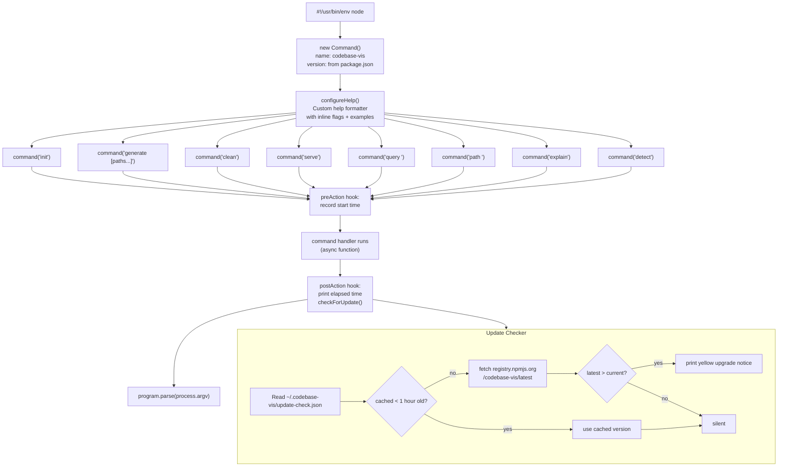

## Per-Command Diagrams

### `init` command

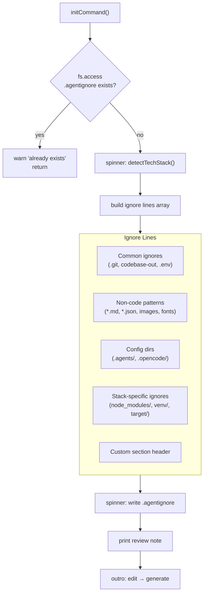

### `generate` command

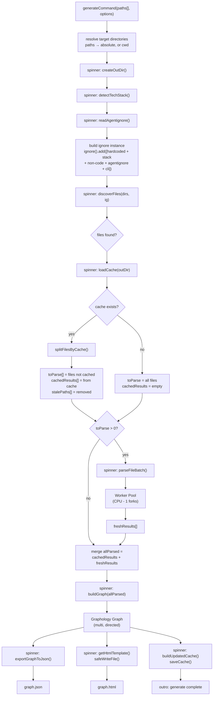

### `clean` command

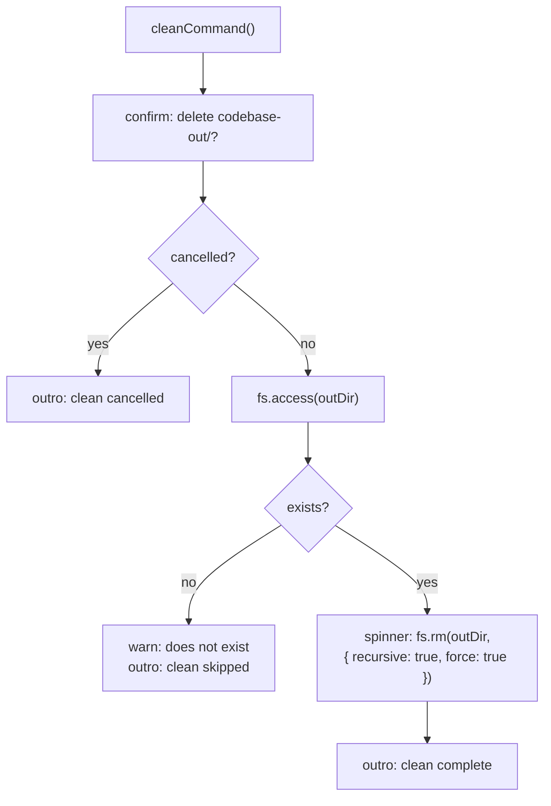

### `serve` command

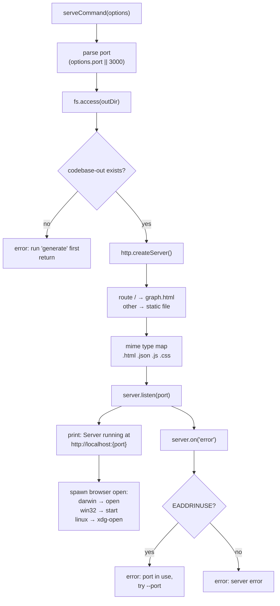

### `query` command

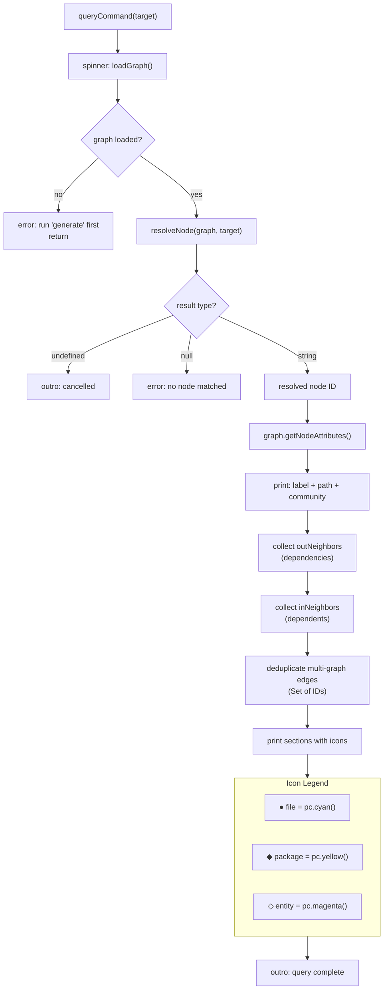

### `path` command

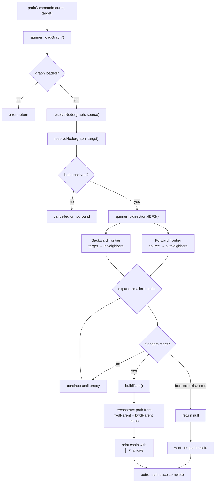

### `detect` command

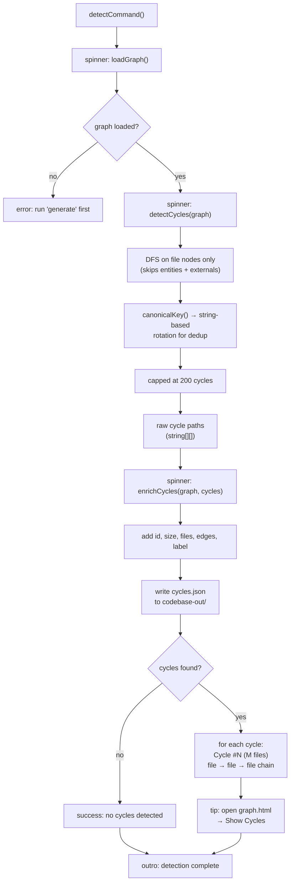

### `explain` command

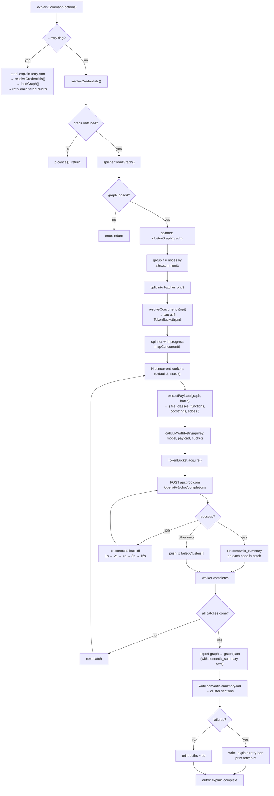

## Shared Utilities

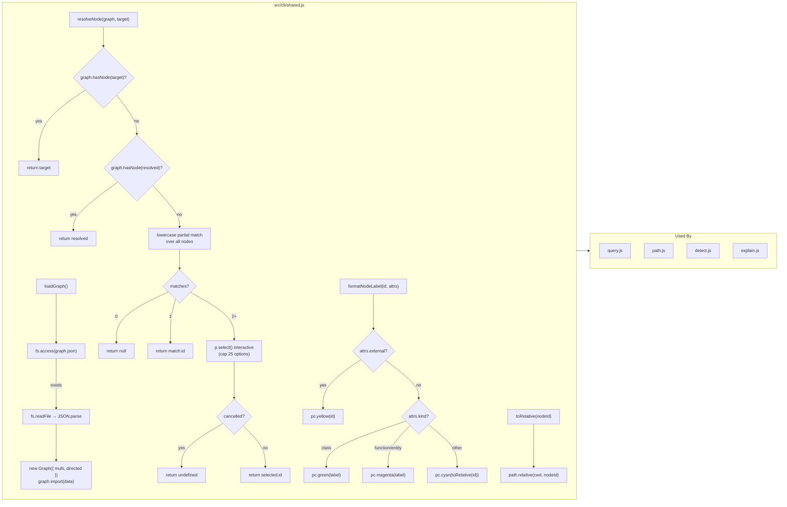

### `callLLMWithRetry` / `TokenBucket` (explain.js)

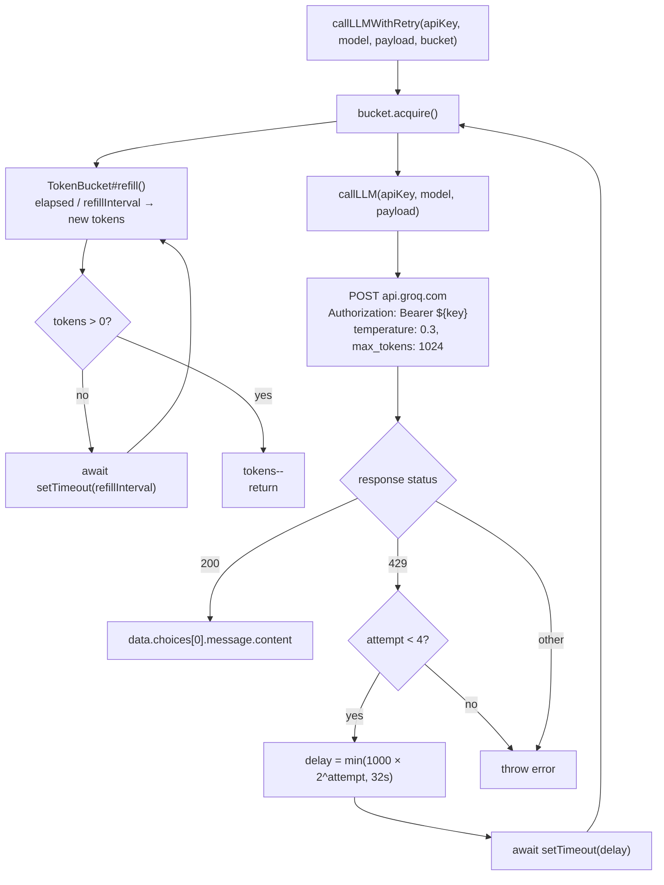

## Error Handling Patterns

| Command | Graceful Early Return | Per-Item Resilience | Catch-all |
|---|---|---|---|
| `init` | `.agentignore` exists → warn, return | — | Uncaught → Node crash |
| `generate` | — | Parse errors per-file (stored, not thrown); `--verbose` shows details | Uncaught → Node crash |
| `clean` | `confirm` cancelled → return; `outDir` missing → warn, return | — | Uncaught → Node crash |
| `serve` | `codebase-out/` missing → error, return | — | Server `error` event (EADDRINUSE handled) |
| `query` | `loadGraph()` null → error, return; `resolveNode()` null/cancel → return | — | Uncaught → Node crash |
| `path` | Same as `query` | — | Uncaught → Node crash |
| `detect` | `loadGraph()` null → error, return | — | Top-level try/catch → stop spinner, print message |
| `explain` | `loadGraph()` null → return; credentials cancelled → return; 0 clusters → warn | Per-cluster LLM failures → write `retry.json`, continue | Uncaught → Node crash |

**Observations:**
- `detect` is the only command with a top-level try/catch wrapping its entire logic.
- `explain` has the most resilient error handling (retry file, per-cluster catch, credential management).
- Most commands rely on Node's default unhandled-rejection behavior for unexpected errors.
- The `checkForUpdate()` function swallows all errors silently (network/disk failures are non-fatal).
