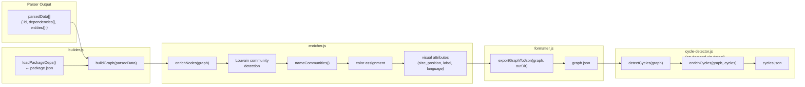
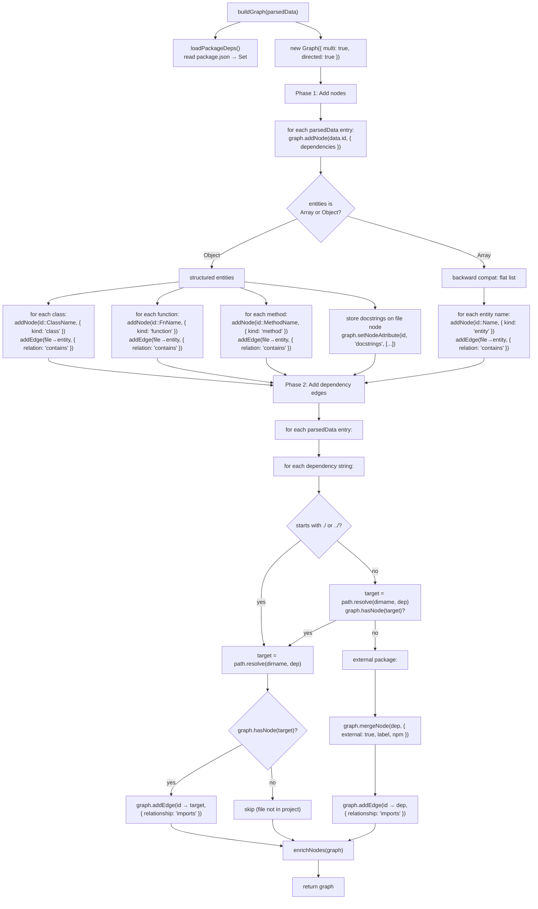
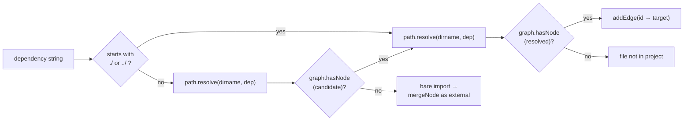
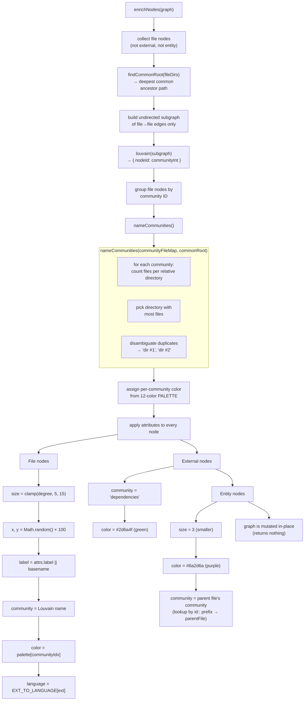
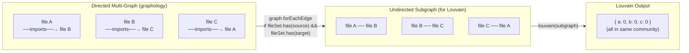
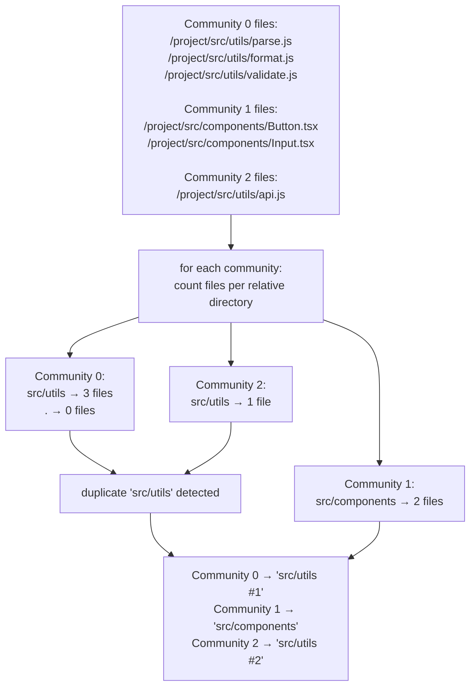
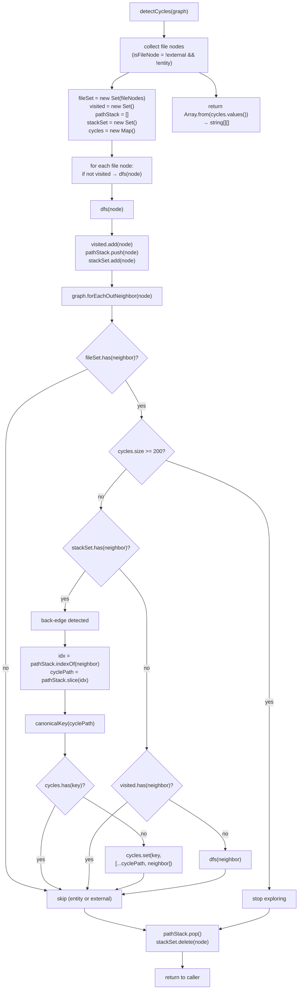
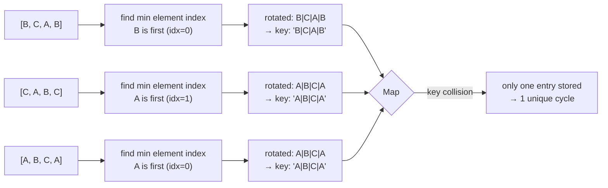
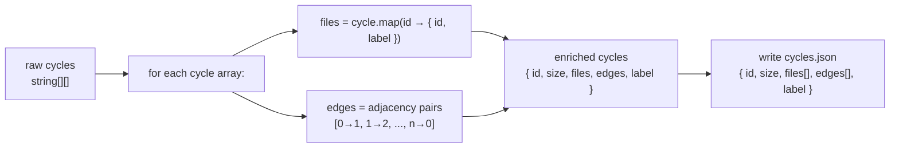
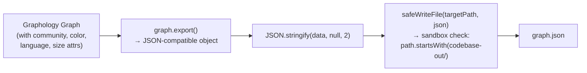

# Graph Architecture

Builds a directed multi-graph from parsed file data, enriches it with community detection and colors, detects circular dependencies, and exports to JSON.

## Module Overview

The graph layer takes the parsed output from the parser module and constructs a `graphology` `Graph` instance. Three phases run sequentially:

1. **`buildGraph()`** — Adds file nodes, entity sub-nodes, external package nodes, and dependency edges.
2. **`enrichNodes()`** — Runs Louvain community detection on the file-only subgraph, names communities by dominant directory, assigns colors, sets visual attributes.
3. **`exportGraphToJson()`** — Serializes to `graph.json` via sandboxed write.

Cycle detection (`detectCycles()`) is a separate offline analysis that runs on-demand via the `detect` CLI command.

## File Reference

| File | Exports | Role |
|---|---|---|
| `src/graph/builder.js` | `buildGraph()` | Main entry: parses parsed data into Graphology graph |
| `src/graph/enricher.js` | `enrichNodes()`, `findCommonRoot()` | Louvain communities, naming, colors, visual layout attrs |
| `src/graph/formatter.js` | `exportGraphToJson()` | Serializes graph to `graph.json` |
| `src/graph/cycle-detector.js` | `detectCycles()`, `enrichCycles()` | DFS-based cycle detection with canonical dedup |

## Overall Pipeline

## buildGraph()

### Node Types

| Type | Example | Attributes | Created By |
|---|---|---|---|
| **File** | `/src/app.js` | `{ dependencies, docstrings? }` | `addNode(data.id, ...)` |
| **Entity (structured)** | `/src/app.js::App` | `{ label: 'App', kind: 'class' }` | `classes`, `functions`, `methods` loops |
| **Entity (flat)** | `/src/app.js::utils` | `{ label: 'utils', kind: 'entity' }` | Backward-compat flat list |
| **External** | `express` | `{ external: true, label: 'express', npm: true }` | Bare import resolution |

### Edge Types

| Relation | From | To | Style in Visualization |
|---|---|---|---|
| `contains` (dashed) | File | Entity | Dashed line, entity color |
| `imports` (solid) | File | File | Solid line, source node's community color |
| `imports` (solid) | File | External | Solid line, external color |

### Dependency Resolution

## enrichNodes()

### Louvain Community Detection

### Community Naming Example

## cycle-detector

### Canonical Key Deduplication

Without dedup, a 3-node cycle `A→B→C→A` would be detected from three different entry points:
- `[A, B, C, A]` (entered at A)
- `[B, C, A, B]` (entered at B)
- `[C, A, B, C]` (entered at C)

### `enrichCycles()`

## formatter

The `graph.export()` call serializes the entire graphology graph into the standard graphology JSON format, which includes all nodes with their attributes, all edges with their attributes, and graph options (`type: mixed`, `multi: true`, `allowSelfLoops: true`).

## Attribute Summary

After enrichment, every node has these attributes:

| Attribute | Type | Source | Example |
|---|---|---|---|
| `label` | string | `basename(node)` or `attrs.label` | `app.js` |
| `size` | number | `clamp(degree, 5, 15)` for files; `3` for entities | `8` |
| `x`, `y` | number | `Math.random() × 100` (ForceAtlas2 rearranges in browser) | `42.7` |
| `color` | string | Palette index for files, `#2d6a4f` for externals, `#6a2d6a` for entities | `#4E79A7` |
| `community` | string | Louvain community name | `src/utils` |
| `language` | string | `EXT_TO_LANGUAGE[ext]` | `JavaScript` |
| `external` | boolean | External packages only | `true` |
| `kind` | string | Entity nodes only: `class`, `function`, `method`, `entity` | `class` |
| `npm` | boolean | External packages only: listed in `package.json` | `true` |
| `dependencies` | string[] | File nodes only | `['./utils.js']` |
| `docstrings` | string[] | File nodes only (if extracted) | `['/** ... */']` |
