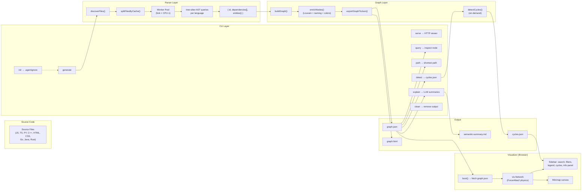
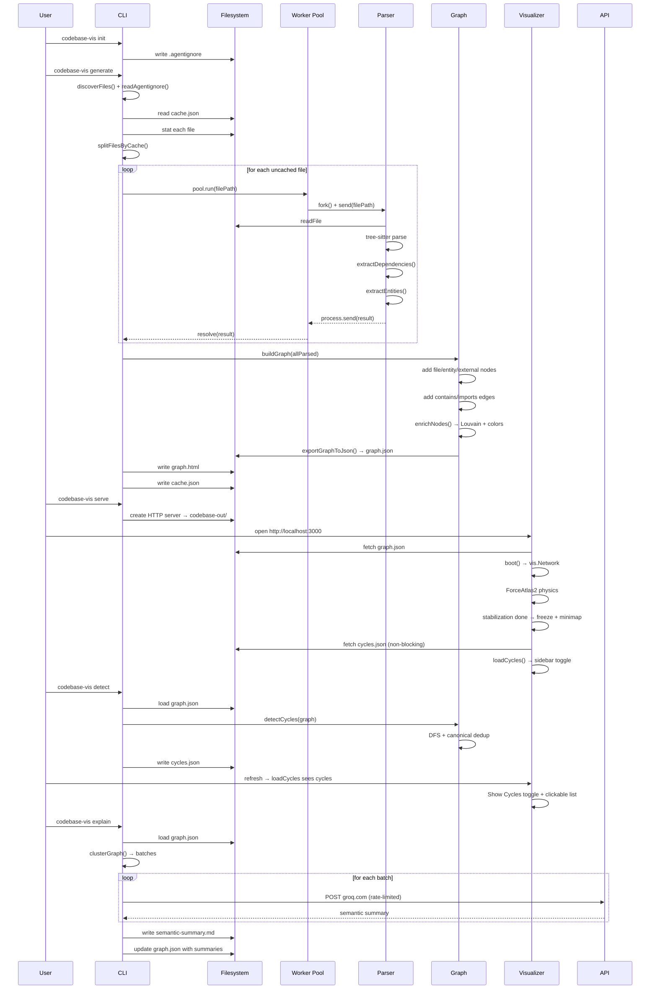

# codebase-vis Architecture Overview

## Full Pipeline



## Data Transformations

```mermaid
flowchart LR
    S["Source Files<br/>(on disk)"] -->|discoverFiles<br/>+ splitByCache| F["File Paths<br/>string[]"]
    F -->|Worker Pool<br/>+ tree-sitter| P["Parsed Data<br/>{ id, deps[], entities{} }[]"]
    P -->|buildGraph| G["Graphology Graph<br/>(multi, directed,~ 163 nodes avg)"]
    G -->|enrichNodes| GE["Enriched Graph<br/>(+ community, color,<br/>language, size, position)"]
    GE -->|exportGraphToJson| GJ["graph.json<br/>(JSON serialization)"]
    GJ -->|boot() in browser| V["vis.Network<br/>(interactive visualization)"]
    GJ -->|detectCycles| CC["raw cycles<br/>string[][]"]
    CC -->|enrichCycles| CJ["cycles.json<br/>(files, edges, labels)"]
```

## Document Index

| File | Covers |
|---|---|
| `ARCHITECTURE/cli.md` | Commander setup, all 8 commands, shared utilities, error handling |
| `ARCHITECTURE/parser.md` | File discovery, cache, worker pool, tree-sitter parsers per language |
| `ARCHITECTURE/graph.md` | Graph builder, Louvain enricher, cycle detector, JSON exporter |
| `ARCHITECTURE/visualizer.md` | graph.html boot sequence, vis-network, sidebar, minimap, cycles overlay |
| `ARCHITECTURE/utils.md` | Sandboxed file writes, traversal, cache CRUD, worker pool lifecycle |

## Project Map

```
codebase-vis/
│
├── bin/
│   └── codebase-vis.js              CLI entry point (commander)
│
├── src/
│   ├── cli/
│   │   ├── commands/
│   │   │   ├── init.js               .agentignore creator
│   │   │   ├── generate.js           File discovery → parse → graph → export
│   │   │   ├── clean.js              Output directory deletion
│   │   │   ├── serve.js              Static HTTP server
│   │   │   ├── query.js              Node dependency inspection
│   │   │   ├── path.js               Bidirectional BFS shortest path
│   │   │   ├── explain.js            LLM-powered semantic summaries
│   │   │   ├── detect.js             Cycle detection
│   │   │   └── index.js              Barrel re-exports
│   │   └── shared.js                 loadGraph, resolveNode, formatNodeLabel
│   │
│   ├── parser/
│   │   ├── index.js                  Orchestrator: parseFile + parseFileBatch
│   │   ├── parse-worker.js           Forked child process
│   │   ├── javascript.js             JS/JSX grammar + queries
│   │   ├── typescript.js             TS/TSX grammar + queries
│   │   ├── python.js                 Python grammar + queries
│   │   ├── cpp.js                    C/C++ grammar + queries
│   │   ├── html.js                   HTML grammar + queries
│   │   ├── css.js                    CSS grammar + queries
│   │   ├── go.js                     Go grammar + queries
│   │   ├── java.js                   Java grammar + queries
│   │   ├── rust.js                   Rust grammar + queries
│   │   ├── languages.js              Language metadata + extension maps
│   │   └── stack-detector.js         Framework detection
│   │
│   ├── graph/
│   │   ├── builder.js                Graph construction from parsed data
│   │   ├── enricher.js               Louvain + naming + colors
│   │   ├── formatter.js              JSON serialization
│   │   └── cycle-detector.js         DFS cycle detection
│   │
│   ├── templates/
│   │   ├── graph/
│   │   │   ├── frame.html            HTML skeleton
│   │   │   ├── style.css             Visual styles
│   │   │   └── script.js             Visualizer logic
│   │   └── graph-template.js         Assembles frame + CSS + JS → self-contained HTML
│   │
│   └── utils/
│       ├── file-system.js            Sandboxed writes, output path
│       ├── traversal.js              Recursive file walker
│       ├── cache.js                  Incremental parse cache
│       └── worker-pool.js            Fork-based worker pool
│
├── test/                             Node --test suite
│   ├── cli/
│   │   └── shared.test.js
│   ├── graph/
│   │   ├── builder.test.js
│   │   ├── cycle-detector.test.js
│   │   ├── enricher.test.js
│   │   └── formatter.test.js
│   ├── parser/
│   │   ├── cpp.test.js
│   │   ├── css.test.js
│   │   ├── dummy-polyglot.test.js
│   │   ├── html.test.js
│   │   ├── index.test.js
│   │   ├── javascript.test.js
│   │   ├── python.test.js
│   │   ├── stack-detector.test.js
│   │   └── typescript.test.js
│   ├── templates/
│   │   └── graph-template.test.js
│   └── utils/
│       ├── cache.test.js
│       ├── file-system.test.js
│       ├── traversal.test.js
│       └── worker-pool.test.js
│
├── ARCHITECTURE/
│   ├── overview.md                   This file
│   ├── cli.md                        CLI commands and dispatch
│   ├── parser.md                     File discovery, cache, parsers
│   ├── graph.md                      Graph construction and enrichment
│   ├── visualizer.md                 Browser visualization
│   └── utils.md                      Shared utility modules
│
├── usage/                            Screenshots for USAGE.md
├── docs/                             Planning documents (MVP phases)
├── dummy-polyglot/                   Multi-language test fixture
│
├── package.json
├── README.md
├── USAGE.md
├── CHANGELOG.md
├── CONTRIBUTING.md
├── LICENSE
└── .github/workflows/publish.yml     CI: test → npm publish
```

## Key Data Flow: End-to-End



## Dependency Graph (Module-Level)

```mermaid
flowchart TD
    BIN["bin/codebase-vis.js"] --> CMDS["src/cli/commands/index.js"]

    CMDS --> INIT["init.js"]
    CMDS --> GEN["generate.js"]
    CMDS --> CLEAN["clean.js"]
    CMDS --> SERVE["serve.js"]
    CMDS --> QUERY["query.js"]
    CMDS --> PATH["path.js"]
    CMDS --> EXPLAIN["explain.js"]
    CMDS --> DETECT["detect.js"]

    GEN --> TRAV["utils/traversal.js"]
    GEN --> CACHE["utils/cache.js"]
    GEN --> FS["utils/file-system.js"]
    GEN --> SD["parser/stack-detector.js"]
    GEN --> IDX["parser/index.js"]
    GEN --> BG["graph/builder.js"]
    GEN --> FE["graph/formatter.js"]
    GEN --> GT["templates/graph-template.js"]

    IDX --> WP["utils/worker-pool.js"]
    IDX --> PW["parser/parse-worker.js"]

    PW --> JS["parser/javascript.js"]
    PW --> TS["parser/typescript.js"]
    PW --> PY["parser/python.js"]
    PW --> CPP["parser/cpp.js"]
    PW --> HTML["parser/html.js"]
    PW --> CSS["parser/css.js"]
    PW --> GO["parser/go.js"]
    PW --> JAVA["parser/java.js"]
    PW --> RUST["parser/rust.js"]

    BG --> ENRICH["graph/enricher.js"]
    ENRICH --> LANG["parser/languages.js"]

    DETECT --> CD["graph/cycle-detector.js"]
    DETECT --> SHARED["cli/shared.js"]
    QUERY --> SHARED
    PATH --> SHARED
    EXPLAIN --> SHARED

    SHARED --> FS
    CLEAN --> FS
    SERVE --> FS
    DETECT --> FS
    EXPLAIN --> FS

    GT --> TEMPLATE["templates/graph/{frame,style,script}"]
```



## Tech Stack

| Technology | Purpose |
|---|---|
| Node.js ≥18 | Runtime |
| commander | CLI framework (argument parsing, help) |
| graphology | Directed multi-graph data structure |
| graphology-communities-louvain | Community detection for module grouping |
| tree-sitter (×10 languages) | AST-driven code parsing |
| @clack/prompts | Terminal UI (spinners, prompts, confirms) |
| picocolors | Terminal coloring |
| ignore | .gitignore-style pattern matching |
| vis-network (CDN) | Browser graph rendering with ForceAtlas2 |
