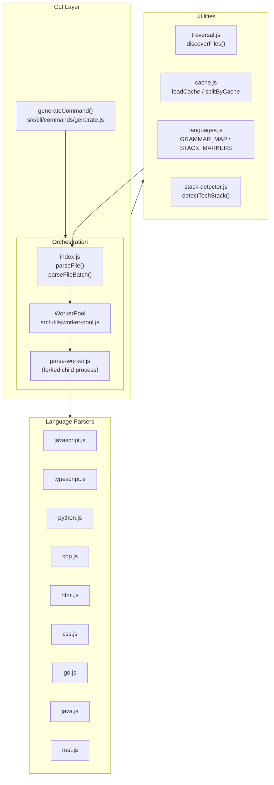
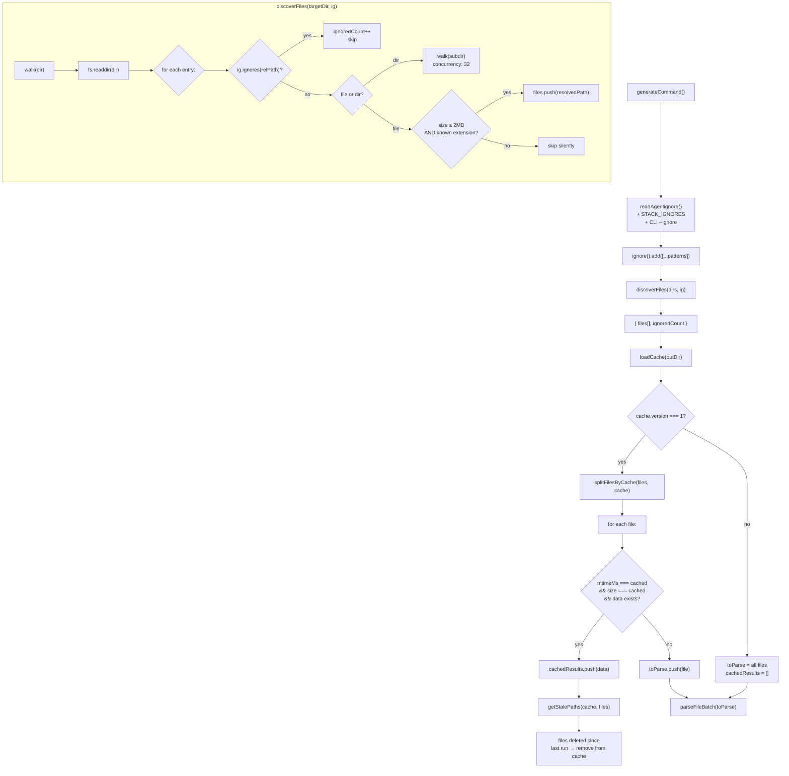
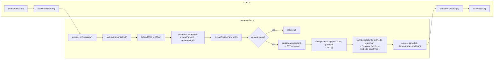
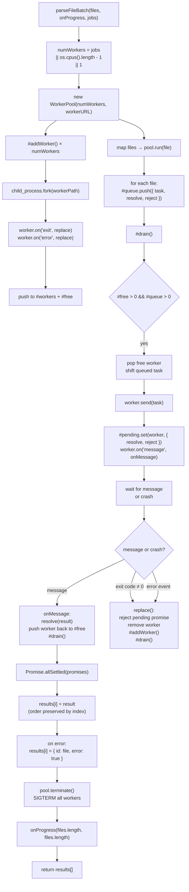
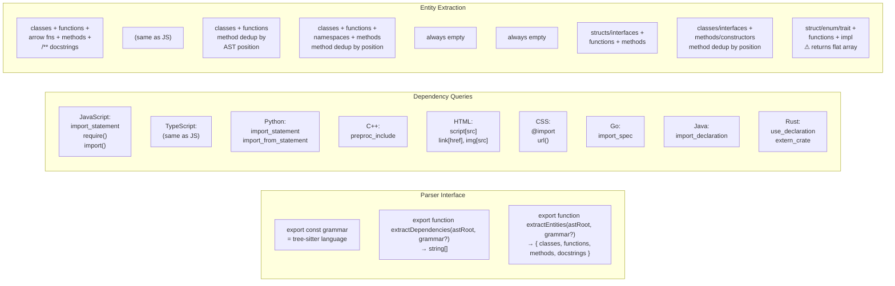
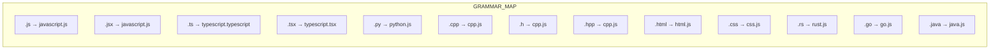
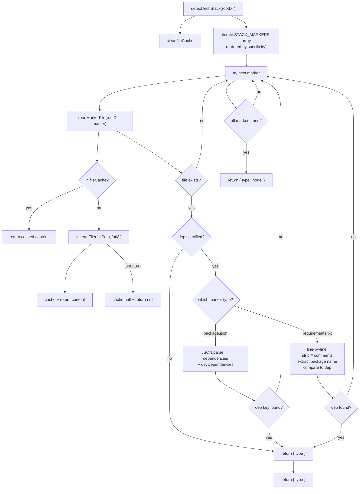
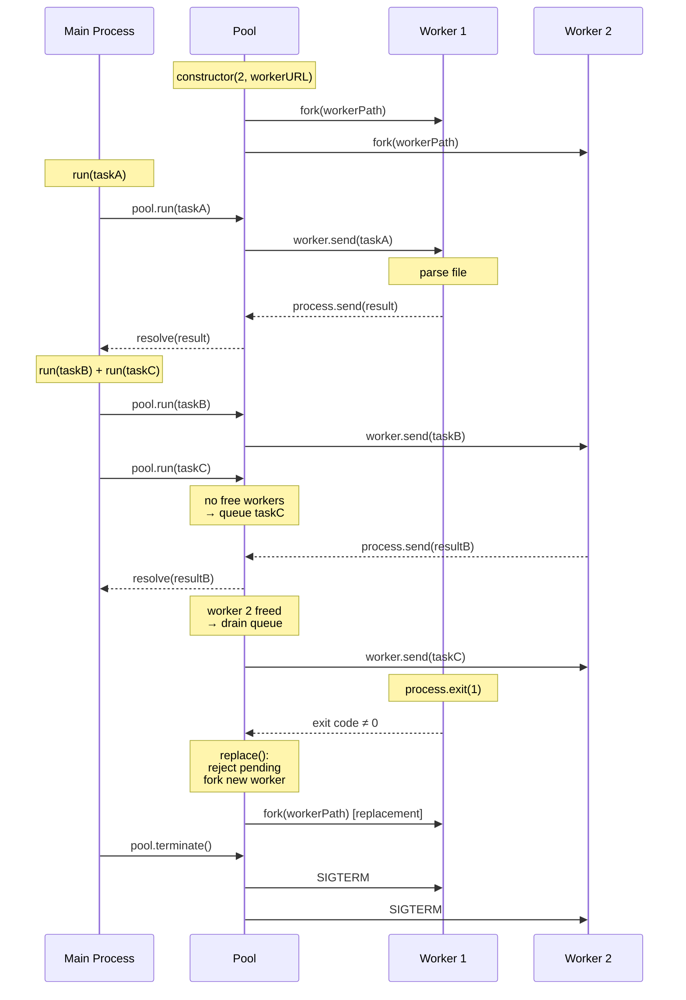

# Parser Architecture

The parser module discovers source files, extracts dependencies and entities via tree-sitter AST queries, and returns structured data for graph construction.

## Module Overview

Three conceptual layers:

- **Orchestration** — `src/parser/index.js` + `src/parser/parse-worker.js` coordinate single-file and batch-parallel parsing via a `WorkerPool`.
- **Language Parsers** — One file per language (`javascript.js`, `typescript.js`, `python.js`, `cpp.js`, `html.js`, `css.js`, `go.js`, `java.js`, `rust.js`). Each exports a tree-sitter grammar, a dependency extractor, and an entity extractor.
- **Utilities** — File discovery (`traversal.js`), incremental cache (`cache.js`), worker pool management (`worker-pool.js`), language metadata (`languages.js`), and stack detection (`stack-detector.js`).

## File Reference

| File | Exports | Role |
|---|---|---|
| `src/parser/index.js` | `parseFile()`, `parseFileBatch()` | Orchestrator: single file and batch-parallel entry points |
| `src/parser/parse-worker.js` | — (child process) | Forked worker: receives file path via IPC, returns parsed result |
| `src/parser/javascript.js` | `grammar`, `extractDependencies()`, `extractEntities()` | JS/JSX parser |
| `src/parser/typescript.js` | `grammar`, `tsxGrammar`, `extractDependencies()`, `extractEntities()` | TS/TSX parser (shares JS dependency queries) |
| `src/parser/python.js` | `grammar`, `extractDependencies()`, `extractEntities()` | Python parser (method dedup by AST position) |
| `src/parser/cpp.js` | `grammar`, `extractDependencies()`, `extractEntities()` | C/C++ parser (system + string includes) |
| `src/parser/html.js` | `grammar`, `extractDependencies()`, `extractEntities()` | HTML parser (script src, link href, img src) |
| `src/parser/css.js` | `grammar`, `extractDependencies()`, `extractEntities()` | CSS parser (@import, url(), deduplicated) |
| `src/parser/go.js` | `grammar`, `extractDependencies()`, `extractEntities()` | Go parser (import_spec, type/function/method) |
| `src/parser/java.js` | `grammar`, `extractDependencies()`, `extractEntities()` | Java parser (import, class/interface, method/constructor) |
| `src/parser/rust.js` | `grammar`, `extractDependencies()`, `extractEntities()` | Rust parser (use, extern crate, struct/enum/trait/fn) |
| `src/parser/languages.js` | `LANGUAGES`, `EXT_TO_LANGUAGE`, `EXT_TO_PARSER`, `KNOWN_EXTENSIONS`, `STACK_MARKERS`, `detectLanguages()` | Language metadata + tech stack markers |
| `src/parser/stack-detector.js` | `detectTechStack()` | Framework detection from marker files |
| `src/utils/traversal.js` | `discoverFiles()` | Recursive file walker with ignore filter + size cap |
| `src/utils/worker-pool.js` | `WorkerPool` class | Fork-based worker pool with crash recovery |
| `src/utils/cache.js` | `loadCache()`, `saveCache()`, `splitFilesByCache()`, `getStalePaths()`, `buildUpdatedCache()` | Incremental parse cache (mtime + size fingerprints) |

## Architecture Layers



## File Discovery + Cache Flow



## Single-File Parse Flow



## Batch/Parallel Parse (Worker Pool)



## Language Parsers Detail

All parsers follow the same interface but differ in tree-sitter queries and entity extraction logic:



### GRAMMAR_MAP (index.js & parse-worker.js)



### Shared Query Patterns

| Capture Technique | Description | Used By |
|---|---|---|
| `#eq?` predicate | Filter captures where a named node equals a specific string | JS `require`, CSS `url()` |
| `#match?` predicate | Regex match on captured text | HTML `tag_name` = `^(link\|img)$` |
| `@_name` (underscore) | Named capture used only for a predicate, excluded from results | JS `@_func_name`, CSS `@_fn` |
| `startIndex-endIndex` key | Deduplicate by AST byte position (not name) | Python, C++, Java method dedup |
| `stripQuotes()` | Remove surrounding `""` or `''` | Go dependencies, CSS string values |
| `slice(1, -1)` | Remove surrounding `<>` or `""` | C++ include paths |

## Stack Detection



### Detection Priority

The marker array is ordered by specificity. Framework-specific checks (Next.js, Angular, React) come before generic ones (Node.js, Python):

```
nextjs > angular > react > vue > svelte > express > fastify > hono > node
  > django > flask > fastapi > python (pyproject) > python (setup.py)
  > python (requirements.txt) > cpp > rust > go > php > ruby > java
```

## Worker Pool Lifecycle



## Error Handling

| Module | Error Mode | Behavior |
|---|---|---|
| `parseFile()` | Any exception | Returns `null` (caller handles) |
| `parseFileBatch()` | Worker crash | Rejects single promise, stores `{ id, error: true }`, spawns replacement worker |
| `parseFileBatch()` | Parse failure | Per-worker, stored in results array; `--verbose` shows details |
| `discoverFiles()` | `EACCES` on `readdir` | Silently skips directory |
| `discoverFiles()` | `lstat` failure | Silently skips entry |
| `WorkerPool` | Worker exit code ≠ 0 | Auto-replaces, rejects pending promise, drains queue |
| `WorkerPool` | Worker `error` event | Same as exit ≠ 0 |
| `loadCache()` | Missing/corrupt/version mismatch | Returns `null` (all files re-parsed) |
| `splitFilesByCache()` | `fs.stat` failure | File added to `toParse[]` (re-parsed) |
| `buildUpdatedCache()` | `fs.stat` failure | Cache entry deleted |
| `detectTechStack()` | File read error | Marker entry skipped (next priority tried) |
| `readAgentignore()` | File missing | Returns `[]` (no patterns added) |

## Outstanding Inconsistency

`src/parser/rust.js` `extractEntities()` returns a flat `string[]` while every other language returns `{ classes, functions, methods, docstrings }`. The orchestrators (`index.js`, `parse-worker.js`) pass the output through without normalizing, so consumers get different shapes depending on language.
