# Utils Architecture

Shared utility modules used across the CLI, parser, and graph layers.

## Module Overview

Four independent utility modules providing filesystem sandboxing, file discovery, incremental caching, and parallel worker pool management.

## File Reference

| File | Exports | Role |
|---|---|---|
| `src/utils/file-system.js` | `getOutDirPath()`, `createOutDir()`, `safeWriteFile()` | Sandboxed output directory management |
| `src/utils/traversal.js` | `discoverFiles()` | Recursive file walker with ignore filter, size cap, extension filter |
| `src/utils/cache.js` | `loadCache()`, `saveCache()`, `splitFilesByCache()`, `getStalePaths()`, `buildUpdatedCache()` | Incremental parse cache with mtime + size fingerprints |
| `src/utils/worker-pool.js` | `WorkerPool` class | Fork-based parallel worker pool with crash recovery |

## file-system.js

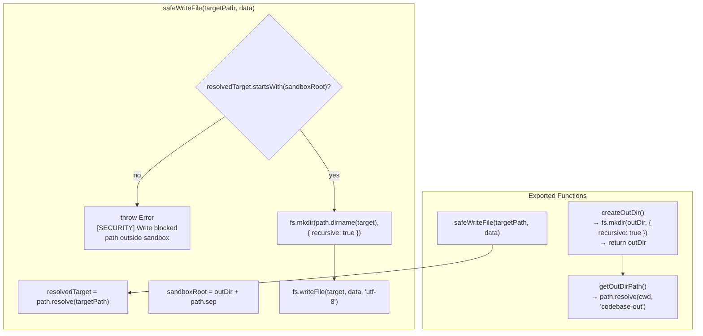

### Constants

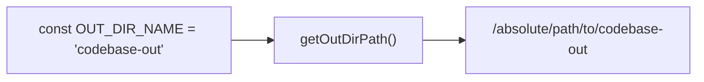

## traversal.js

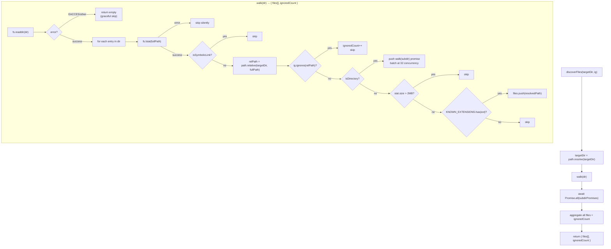

### Ignore Flow

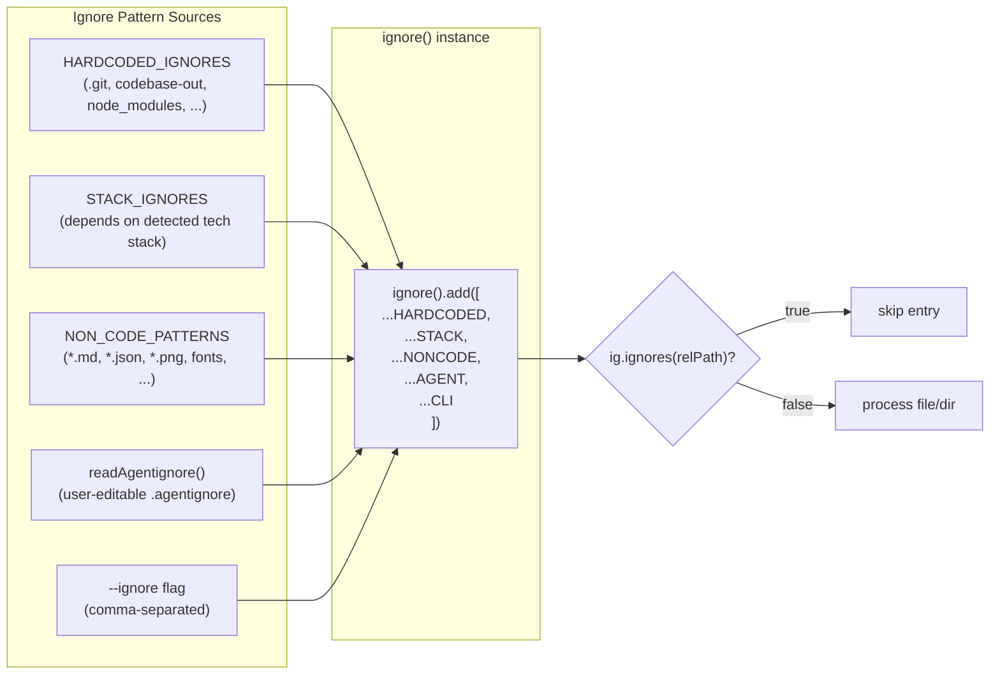

### File Size and Extension Filters

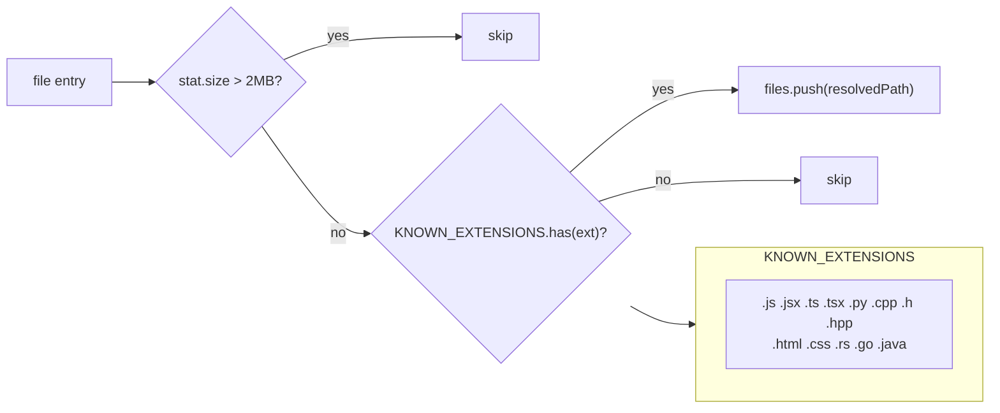

## cache.js

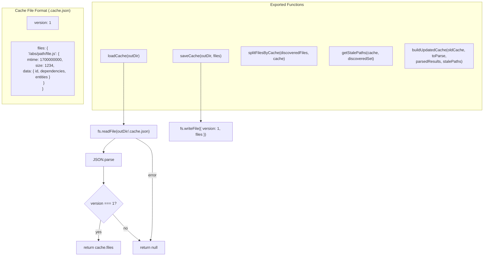

### splitFilesByCache

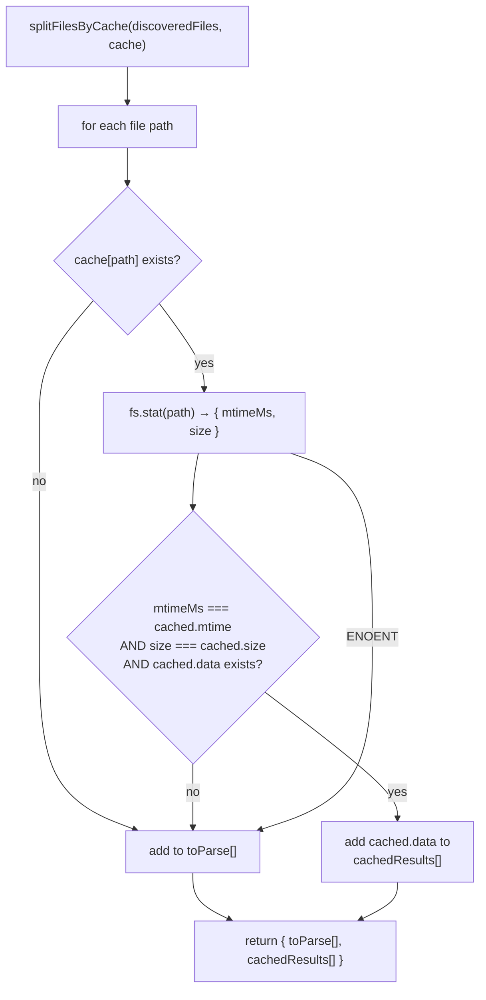

### buildUpdatedCache

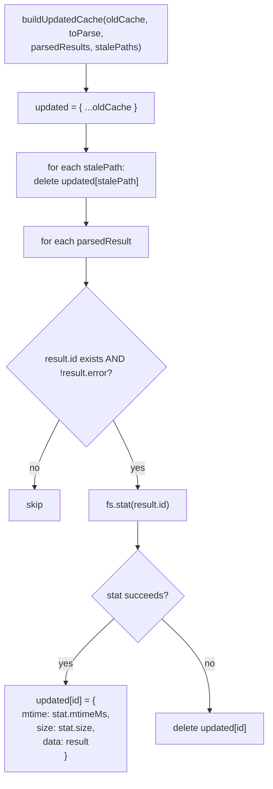

### Cache Lifecycle

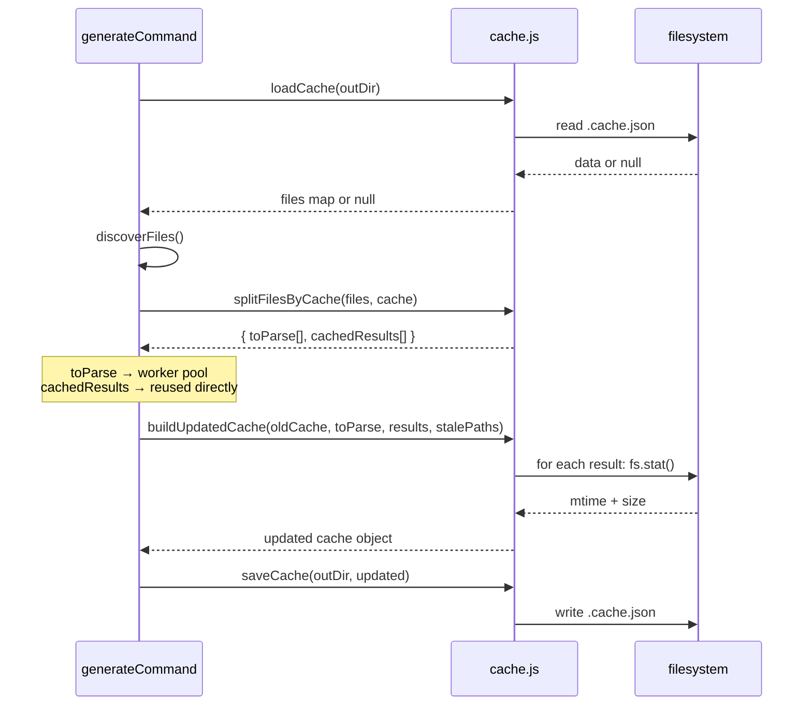

## worker-pool.js

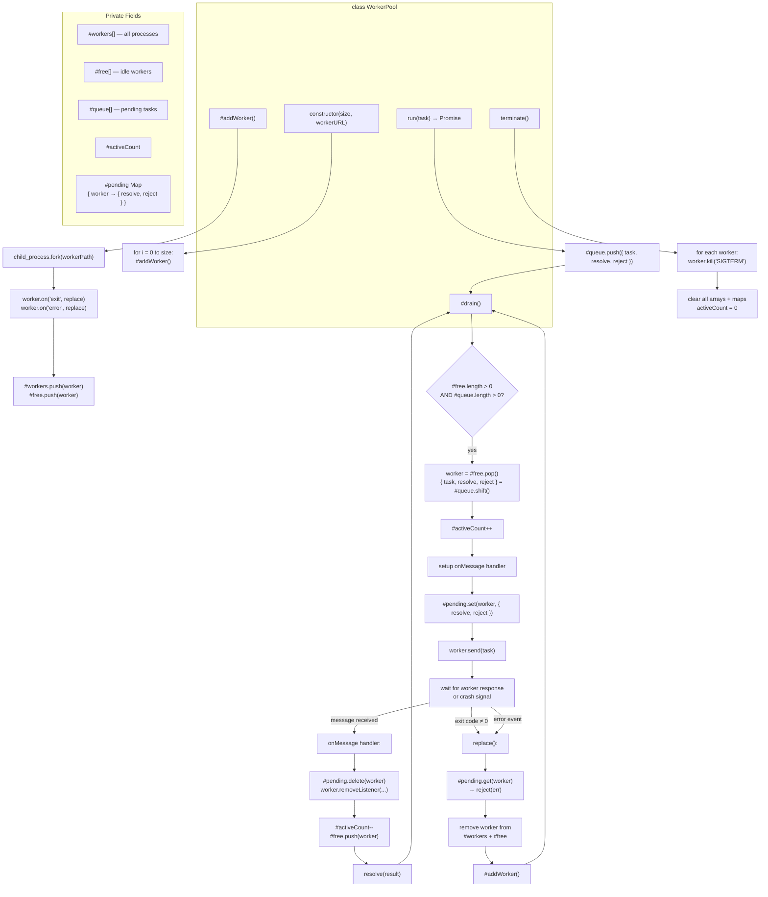

### Worker → Parent IPC

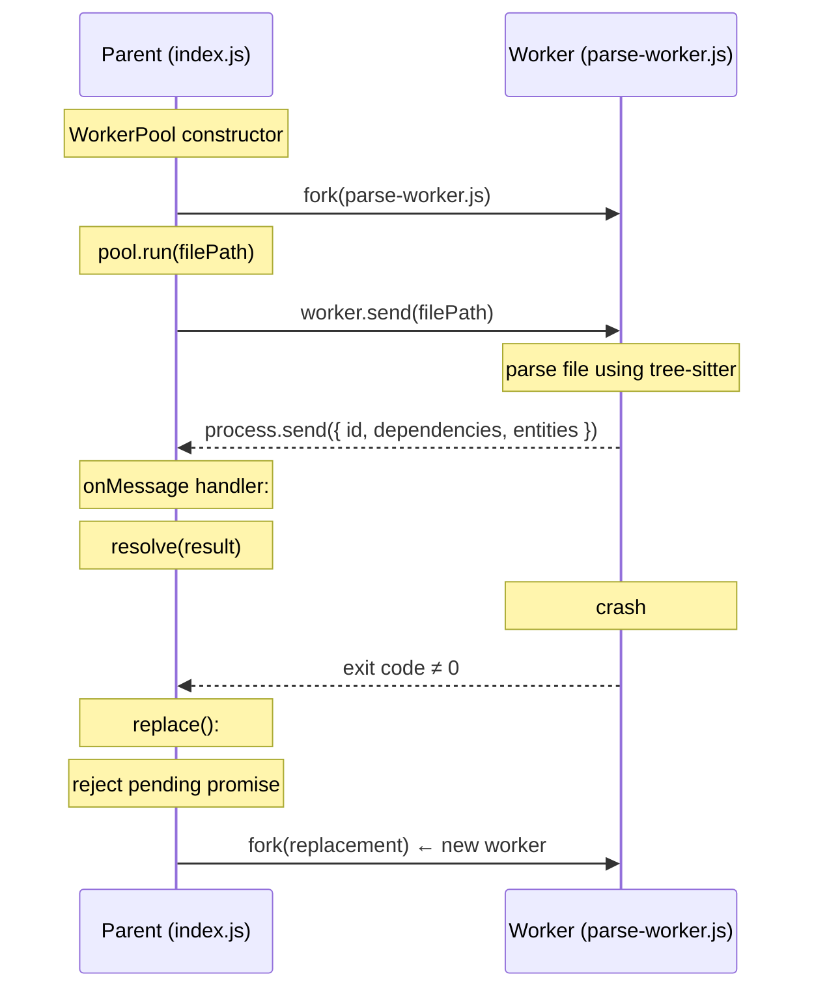

### Worker Lifecycle

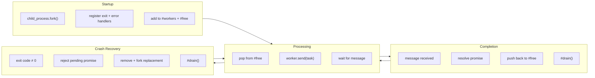

## Error Handling Summary

| Module | Error | Behavior |
|---|---|---|
| `file-system.js` | Path outside sandbox | Throws `[SECURITY]` error — blocked |
| `file-system.js` | `mkdir` failure | Bubble up (unhandled) |
| `file-system.js` | `writeFile` failure | Bubble up |
| `traversal.js` | `readdir` failure | Directory silently skipped |
| `traversal.js` | `lstat` failure | Entry silently skipped |
| `traversal.js` | File > 2MB | Silently skipped |
| `traversal.js` | Unknown extension | Silently skipped |
| `cache.js` | Cache file missing | Return `null` |
| `cache.js` | Version mismatch | Return `null` (full re-parse) |
| `cache.js` | `stat` failure per file | File queued for re-parse / entry deleted |
| `worker-pool.js` | Worker exit ≠ 0 | Auto-replacement, pending promise rejected |
| `worker-pool.js` | Worker error event | Auto-replacement, pending promise rejected |
| `worker-pool.js` | Queue empty / no free workers | Busy-wait via `#drain()` loop |

## Dependency Graph

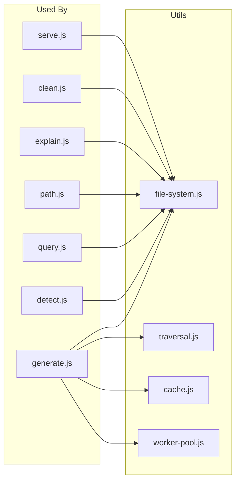
