# Visualizer Architecture

The self-contained HTML visualizer (`graph.html`) that renders the dependency graph in the browser using vis-network.

## Module Overview

`graph.html` is a single-file, self-contained page with no build step or server dependency. It embeds:

- **vis-network** (loaded from CDN at unpkg.com) — the graph rendering engine with ForceAtlas2 physics
- **~450 lines of CSS** — dark theme, glassmorphism sidebar, minimap, spinner, cycle toggle
- **~560 lines of inline JavaScript** in a single `boot()` async function

## File Reference

| File | Role |
|---|---|
| `src/templates/graph.html` | The complete visualizer — HTML structure, CSS, and JavaScript |
| `src/templates/graph-template.js` | Reads `graph.html` from disk with in-memory caching |

## HTML Structure

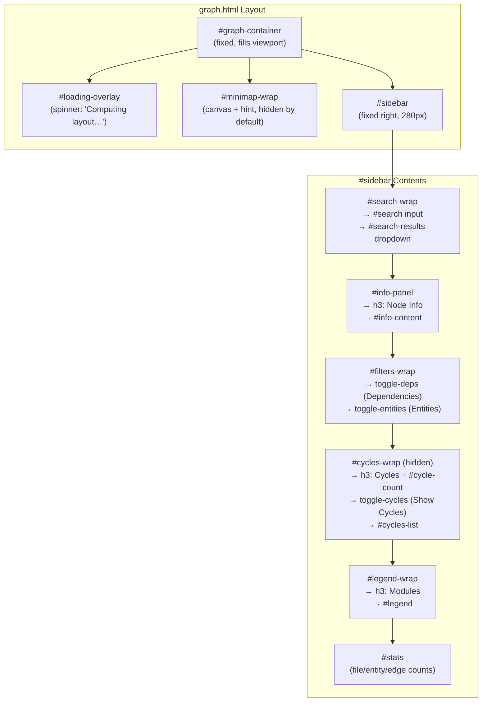

## boot() Sequence

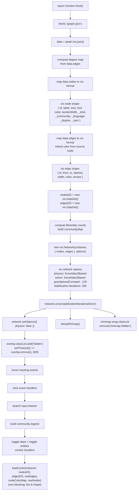

## vis.Network Configuration

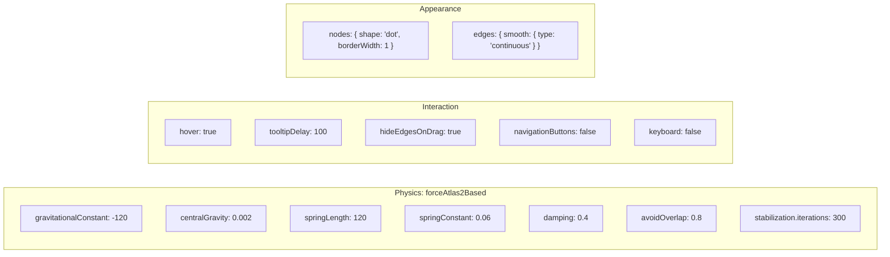

## Node Visual Mapping (graph.json → vis)

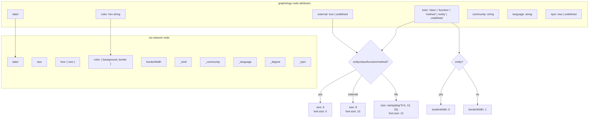

## Edge Visual Mapping

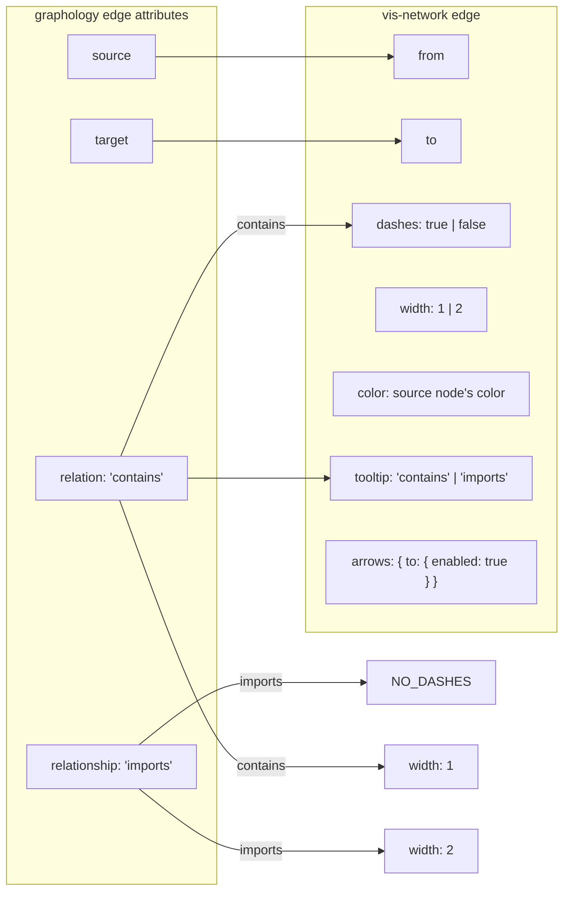

## Event Handlers

```mermaid
flowchart TD
    subgraph hover["Hover Events"]
        HOVER_NODE["network.on('hoverNode')"] --> SHOW_FONT["show entity font<br/>set cursor: pointer"]
        BLUR_NODE["network.on('blurNode')"] --> HIDE_FONT["hide entity font<br/>set cursor: default"]
    end

    subgraph click["Click Events"]
        CONTAINER_CLICK["container click event"] --> HOVER_CHECK{"hoveredNodeId?"}
        HOVER_CHECK -->|yes| SHOW_INFO["showInfo(nodeId)<br/>network.selectNodes([nodeId])"]

        NETWORK_CLICK["network.on('click')"] --> CLICK_NODES{"params.nodes?"}
        CLICK_NODES -->|>0| SHOW_INFO2["showInfo(nodeId)"]
        CLICK_NODES -->|0| CHECK_HOVER{"hoveredNodeId === null?"}
        CHECK_HOVER -->|yes| RESET_INFO["show empty state"]
    end

    subgraph search["Search"]
        INPUT["search input event"] --> QUERY{"q.trim()?"}
        QUERY -->|empty| HIDE["hide results dropdown"]
        QUERY -->|text| MATCH["filter rawNodes by label<br/>max 15 matches"]
        MATCH --> RENDER["render search-item divs"]
        CLICK_ITEM["search-item.onclick"] --> FOCUS["network.focus(id, animation)<br/>selectNodes, showInfo"]
    end

    subgraph legend["Legend Toggle"]
        LEGEND_CLICK["legend-item.onclick"] --> TOGGLE_HIDDEN["hiddenCommunities.toggle(key)"]
        TOGGLE_HIDDEN --> UPDATE["nodesDS.update({ id, hidden })"]
    end

    subgraph filters["Filter Toggles"]
        TOGGLE_DEPS["toggle-deps.onclick"] --> HIDE_DEPS["nodesDS.update(depNodeIds → hidden)"]
        TOGGLE_ENTS["toggle-entities.onclick"] --> HIDE_ENTS["nodesDS.update(entityNodeIds → hidden)"]
    end
```

## showInfo()

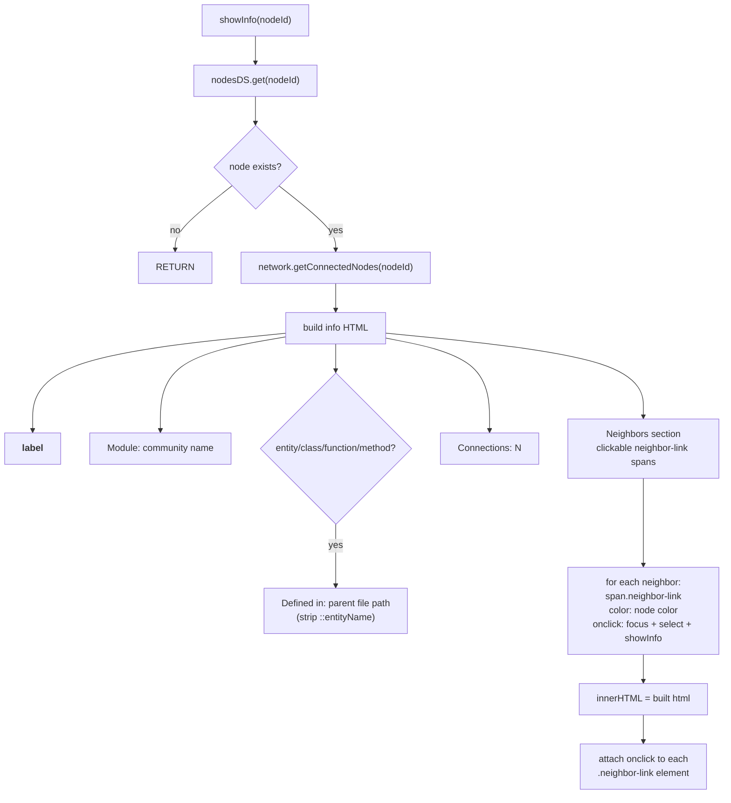

## setupMinimap()

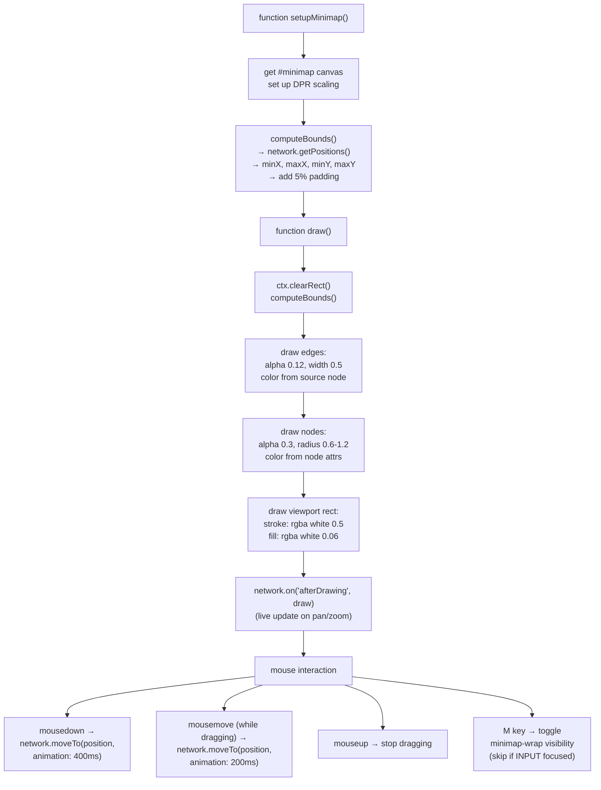

## LoadCycles (Non-blocking Cycle Overlay)

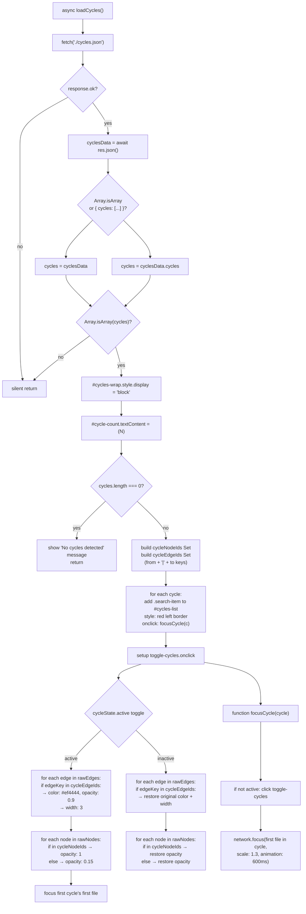

## Event Flow Diagram

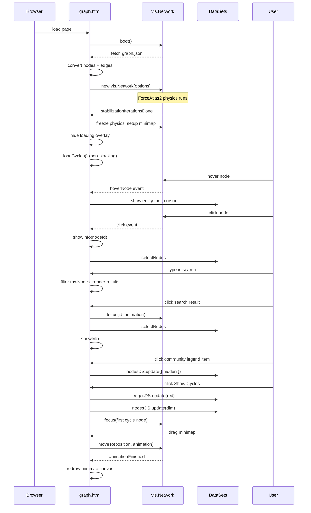

## Error State

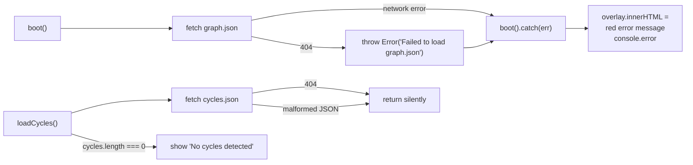

## Key Design Decisions

| Decision | Rationale |
|---|---|
| **Self-contained HTML** | No build step, works offline, can be opened from disk or served via any HTTP server |
| **vis-network from CDN** | Only runtime dependency — 600KB minified, no npm bundling needed |
| **ForceAtlas2 physics** | Produces natural-looking graph layouts where connected nodes cluster together |
| **Physics freezes after stabilization** | Stops jittering once stable; minimap stays in sync via `afterDrawing` event |
| **Non-blocking cycles fetch** | The `boot()` function must never be blocked by optional data — loading overlay must always hide |
| **CommunityMap + hiddenCommunities Set** | Toggling a community is O(n) via `nodesDS.update()` — no re-render needed |
| **Minimap with canvas** | Custom Canvas2D minimap is faster and more responsive than a second vis-network instance |
| **Entity font size 0** | Entities are invisible by default (too numerous) but still present in the graph for hover/click interaction |
