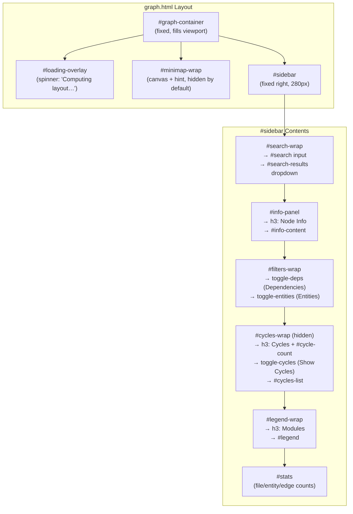
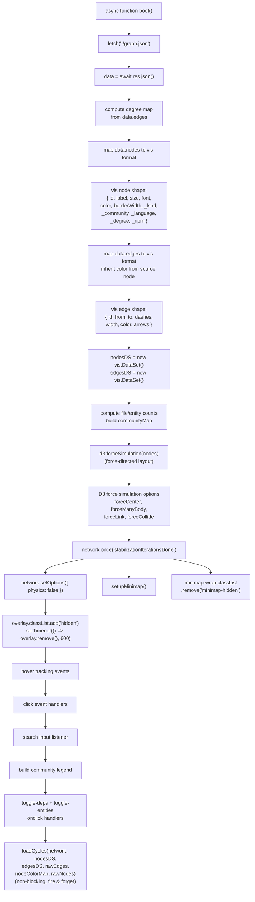
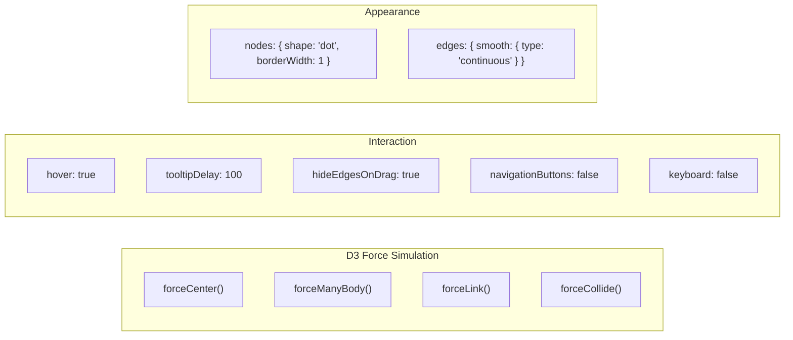
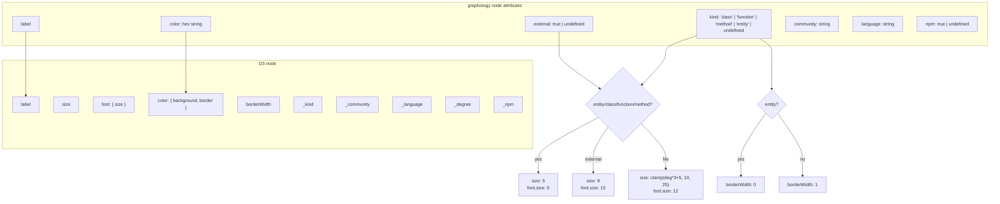
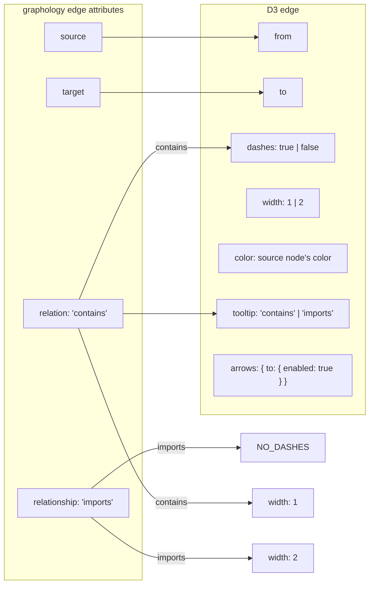
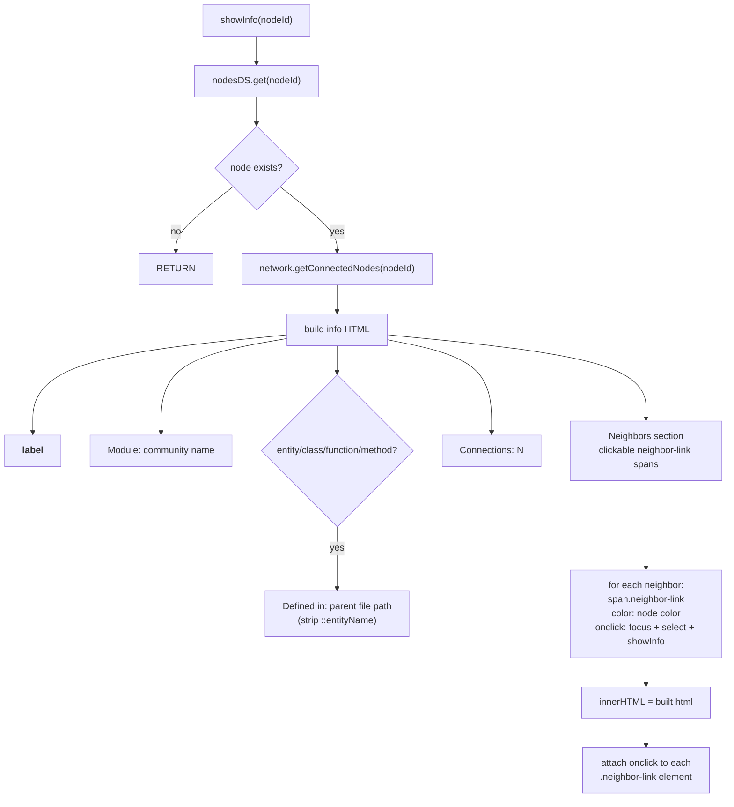
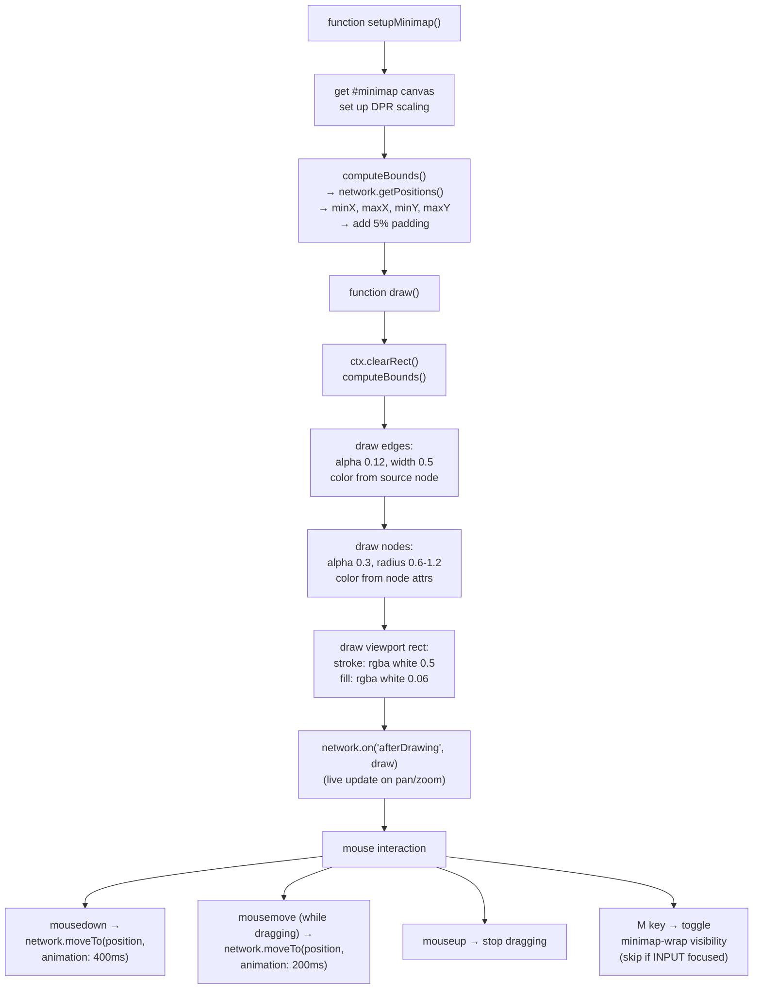
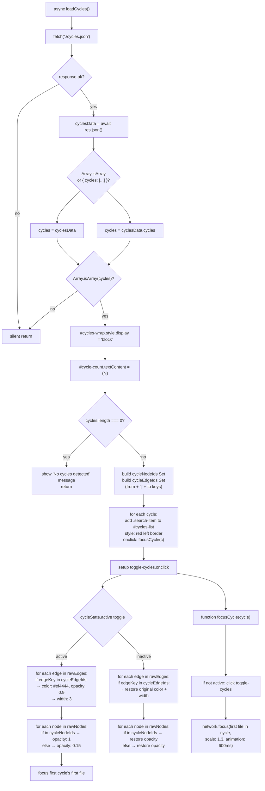
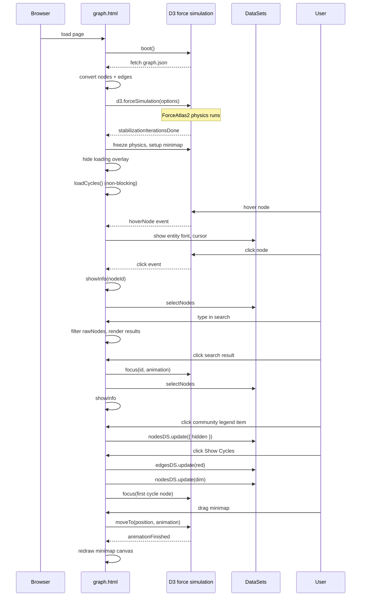
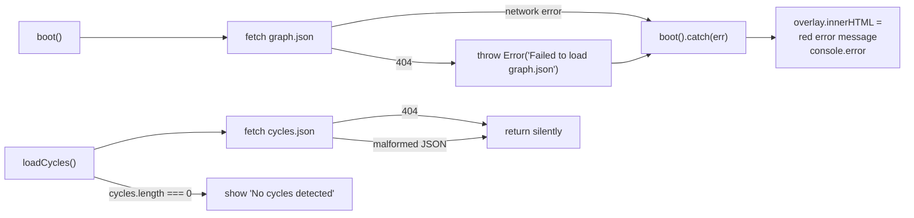

# Visualizer Architecture

The self-contained HTML visualizer (`graph.html`) that renders the dependency graph in the browser using D3 force-directed layout.

## Module Overview

`graph.html` is a single-file, self-contained page with no build step or server dependency. It embeds:

- **D3 v7** (loaded locally from `vendor/d3.v7.min.js`) — the force simulation engine for physics-based graph layout
- **~450 lines of CSS** — dark theme, glassmorphism sidebar, minimap, spinner, cycle toggle
- **~560 lines of inline JavaScript** in a single `boot()` async function

## File Reference

| File | Role |
|---|---|
| `src/templates/graph/frame.html` | HTML skeleton with `<!-- CSS -->` and `<!-- SCRIPT -->` injection points |
| `src/templates/graph/style.css` | Standalone CSS file (all visual styles) |
| `src/templates/graph/script.js` | Standalone JS file (all visualizer logic) |
| `src/templates/graph-template.js` | Reads the 3 files from `graph/` dir, inlines CSS + JS into frame, caches result |

## HTML Structure

```mermaid
flowchart TD
    subgraph page["graph.html Layout"]
        CONTAINER["#graph-container<br/>(fixed, fills viewport)"]
        LOADING["#loading-overlay<br/>(spinner: 'Computing layout…')"]
        MINIMAP["#minimap-wrap<br/>(canvas + hint, hidden by default)"]
        SIDEBAR["#sidebar<br/>(fixed right, 280px)"]
    end

    subgraph sidebar["#sidebar Contents"]
        SEARCH["#search-wrap<br/>→ #search input<br/>→ #search-results dropdown"]
        INFO["#info-panel<br/>→ h3: Node Info<br/>→ #info-content"]
        FILTERS["#filters-wrap<br/>→ toggle-deps (Dependencies)<br/>→ toggle-entities (Entities)"]
        CYCLES["#cycles-wrap (hidden)<br/>→ h3: Cycles + #cycle-count<br/>→ toggle-cycles (Show Cycles)<br/>→ #cycles-list"]
        LEGEND["#legend-wrap<br/>→ h3: Modules<br/>→ #legend"]
        STATS["#stats<br/>(file/entity/edge counts)"]
    end

    CONTAINER --> LOADING
    CONTAINER --> MINIMAP
    CONTAINER --> SIDEBAR
    SIDEBAR --> SEARCH
    SEARCH --> INFO
    INFO --> FILTERS
    FILTERS --> CYCLES
    CYCLES --> LEGEND
    LEGEND --> STATS
```

## boot() Sequence

```mermaid
flowchart TD
    START["async function boot()"] --> FETCH["fetch('./graph.json')"]

    FETCH --> PARSE["data = await res.json()"]

    PARSE --> DEGREE["compute degree map<br/>from data.edges"]

    DEGREE --> CONVERT_NODES["map data.nodes to vis format"]

    CONVERT_NODES --> VIS_NODE["vis node shape:<br/>{ id, label, size, font,<br/>color, borderWidth, _kind,<br/>_community, _language,<br/>_degree, _npm }"]

    VIS_NODE --> CONVERT_EDGES["map data.edges to vis format<br/>inherit color from source node"]

    CONVERT_EDGES --> VIS_EDGE["vis edge shape:<br/>{ id, from, to, dashes,<br/>width, color, arrows }"]

    VIS_EDGE --> DATASETS["nodesDS = new vis.DataSet()<br/>edgesDS = new vis.DataSet()"]

    DATASETS --> STATS["compute file/entity counts<br/>build communityMap"]

    STATS --> NETWORK["d3.forceSimulation(nodes)<br/>(force-directed layout)"]

    NETWORK --> PHYSICS["D3 force simulation options<br/>forceCenter, forceManyBody,<br/>forceLink, forceCollide"]

    PHYSICS --> ONCE["network.once('stabilizationIterationsDone')"]

    ONCE --> FREEZE["network.setOptions({ physics: false })"]
    ONCE --> MINIMAP_SETUP["setupMinimap()"]
    ONCE --> SHOW_MINIMAP["minimap-wrap.classList<br/>.remove('minimap-hidden')"]

    FREEZE --> HIDE_OVERLAY["overlay.classList.add('hidden')<br/>setTimeout(() => overlay.remove(), 600)"]

    HIDE_OVERLAY --> HOVER["hover tracking events"]

    HOVER --> CLICK["click event handlers"]

    CLICK --> SEARCH_HANDLER["search input listener"]

    SEARCH_HANDLER --> LEGEND_BUILD["build community legend"]

    LEGEND_BUILD --> FILTER_HANDLERS["toggle-deps + toggle-entities<br/>onclick handlers"]

    FILTER_HANDLERS --> LOAD_CYCLES["loadCycles(network, nodesDS,<br/>edgesDS, rawEdges,<br/>nodeColorMap, rawNodes)<br/>(non-blocking, fire & forget)"]
```

## D3 Force Configuration

```mermaid
flowchart LR
    subgraph physics["D3 Force Simulation"]
        FC["forceCenter()"]
        FMB["forceManyBody()"]
        FL["forceLink()"]
        FCO["forceCollide()"]
    end

    subgraph interaction["Interaction"]
        H["hover: true"]
        TD["tooltipDelay: 100"]
        HED["hideEdgesOnDrag: true"]
        NB["navigationButtons: false"]
        K["keyboard: false"]
    end

    subgraph appearance["Appearance"]
        NS["nodes: { shape: 'dot', borderWidth: 1 }"]
        ES["edges: { smooth: { type: 'continuous' } }"]
    end
```

## Node Visual Mapping (graph.json → vis)

```mermaid
flowchart TD
    subgraph raw["graphology node attributes"]
        A_label["label"]
        A_kind["kind: 'class' | 'function' | 'method' | 'entity' | undefined"]
        A_external["external: true | undefined"]
        A_color["color: hex string"]
        A_community["community: string"]
        A_language["language: string"]
        A_npm["npm: true | undefined"]
    end

    subgraph vis["D3 node"]
        V_label["label"]
        V_size["size"]
        V_font["font: { size }"]
        V_color["color: { background, border }"]
        V_border["borderWidth"]
        V_kind["_kind"]
        V_community["_community"]
        V_language["_language"]
        V_degree["_degree"]
        V_npm["_npm"]
    end

    A_label --> V_label

    A_kind --> DECIDE_SIZE
    A_external --> DECIDE_SIZE

    DECIDE_SIZE{"entity/class/function/method?"}
    DECIDE_SIZE -->|yes| SIZE_ENTITY["size: 5<br/>font.size: 0"]
    DECIDE_SIZE -->|external| SIZE_EXT["size: 8<br/>font.size: 10"]
    DECIDE_SIZE -->|file| SIZE_FILE["size: clamp(deg*3+5, 10, 25)<br/>font.size: 12"]

    A_color --> V_color

    A_kind --> DECIDE_BORDER{"entity?"}
    DECIDE_BORDER -->|yes| BW0["borderWidth: 0"]
    DECIDE_BORDER -->|no| BW1["borderWidth: 1"]
```

## Edge Visual Mapping

```mermaid
flowchart LR
    subgraph raw_edge["graphology edge attributes"]
        R_source["source"]
        R_target["target"]
        R_rel["relation: 'contains'"]
        R_rel2["relationship: 'imports'"]
    end

    subgraph vis_edge["D3 edge"]
        V_from["from"]
        V_to["to"]
        V_dashes["dashes: true | false"]
        V_width["width: 1 | 2"]
        V_color["color: source node's color"]
        V_title["tooltip: 'contains' | 'imports'"]
        V_arrows["arrows: { to: { enabled: true } }"]
    end

    R_source --> V_from
    R_target --> V_to
    R_rel -->|contains| V_dashes
    R_rel2 -->|imports| NO_DASHES
    R_rel -->|contains| W1["width: 1"]
    R_rel2 -->|imports| W2["width: 2"]
    R_rel --> V_title
```

## Event Handlers

```mermaid
flowchart TD
    subgraph hover["Hover Events"]
        HOVER_NODE["network.on('hoverNode')"] --> SHOW_FONT["show entity font<br/>set cursor: pointer"]
        BLUR_NODE["network.on('blurNode')"] --> HIDE_FONT["hide entity font<br/>set cursor: default"]
    end

    subgraph click["Click Events"]
        CONTAINER_CLICK["container click event"] --> HOVER_CHECK{"hoveredNodeId?"}
        HOVER_CHECK -->|yes| SHOW_INFO["showInfo(nodeId)<br/>network.selectNodes([nodeId])"]

        NETWORK_CLICK["network.on('click')"] --> CLICK_NODES{"params.nodes?"}
        CLICK_NODES -->|>0| SHOW_INFO2["showInfo(nodeId)"]
        CLICK_NODES -->|0| CHECK_HOVER{"hoveredNodeId === null?"}
        CHECK_HOVER -->|yes| RESET_INFO["show empty state"]
    end

    subgraph search["Search"]
        INPUT["search input event"] --> QUERY{"q.trim()?"}
        QUERY -->|empty| HIDE["hide results dropdown"]
        QUERY -->|text| MATCH["filter rawNodes by label<br/>max 15 matches"]
        MATCH --> RENDER["render search-item divs"]
        CLICK_ITEM["search-item.onclick"] --> FOCUS["network.focus(id, animation)<br/>selectNodes, showInfo"]
    end

    subgraph legend["Legend Toggle"]
        LEGEND_CLICK["legend-item.onclick"] --> TOGGLE_HIDDEN["hiddenCommunities.toggle(key)"]
        TOGGLE_HIDDEN --> UPDATE["nodesDS.update({ id, hidden })"]
    end

    subgraph filters["Filter Toggles"]
        TOGGLE_DEPS["toggle-deps.onclick"] --> HIDE_DEPS["nodesDS.update(depNodeIds → hidden)"]
        TOGGLE_ENTS["toggle-entities.onclick"] --> HIDE_ENTS["nodesDS.update(entityNodeIds → hidden)"]
    end
```

## showInfo()

```mermaid
flowchart TD
    START["showInfo(nodeId)"] --> GET["nodesDS.get(nodeId)"]
    GET --> EXISTS{"node exists?"}
    EXISTS -->|no| RETURN
    EXISTS -->|yes| NEIGHBORS["network.getConnectedNodes(nodeId)"]

    NEIGHBORS --> HTML["build info HTML"]

    HTML --> LABEL["<b>label</b>"]
    HTML --> MODULE["Module: community name"]
    HTML --> EXTRA{"entity/class/function/method?"}
    EXTRA -->|yes| PARENT["Defined in: parent file path<br/>(strip ::entityName)"]

    HTML --> CONNS["Connections: N"]
    HTML --> NEIGHBOR_LIST["Neighbors section<br/>clickable neighbor-link spans"]

    NEIGHBOR_LIST --> NEIGHBOR_HTML["for each neighbor:<br/>span.neighbor-link<br/>color: node color<br/>onclick: focus + select + showInfo"]

    NEIGHBOR_HTML --> RENDER["innerHTML = built html"]

    RENDER --> CLICK_HANDLER["attach onclick to each<br/>.neighbor-link element"]
```

## setupMinimap()

```mermaid
flowchart TD
    START["function setupMinimap()"] --> CANVAS["get #minimap canvas<br/>set up DPR scaling"]

    CANVAS --> COMPUTE_BOUNDS["computeBounds()<br/>→ network.getPositions()<br/>→ minX, maxX, minY, maxY<br/>→ add 5% padding"]

    COMPUTE_BOUNDS --> DRAW["function draw()"]

    DRAW --> CLEAR["ctx.clearRect()<br/>computeBounds()"]

    CLEAR --> EDGES["draw edges:<br/>alpha 0.12, width 0.5<br/>color from source node"]

    EDGES --> NODES["draw nodes:<br/>alpha 0.3, radius 0.6-1.2<br/>color from node attrs"]

    NODES --> VIEWPORT["draw viewport rect:<br/>stroke: rgba white 0.5<br/>fill: rgba white 0.06"]

    VIEWPORT --> REGISTER["network.on('afterDrawing', draw)<br/>(live update on pan/zoom)"]

    REGISTER --> MOUSE_EVENTS["mouse interaction"]

    MOUSE_EVENTS --> MOUSEDOWN["mousedown →<br/>network.moveTo(position,<br/>animation: 400ms)"]

    MOUSE_EVENTS --> MOUSEMOVE["mousemove (while dragging) →<br/>network.moveTo(position,<br/>animation: 200ms)"]

    MOUSE_EVENTS --> MOUSEUP["mouseup → stop dragging"]

    MOUSE_EVENTS --> M_KEY["M key → toggle<br/>minimap-wrap visibility<br/>(skip if INPUT focused)"]
```

## LoadCycles (Non-blocking Cycle Overlay)

```mermaid
flowchart TD
    START["async loadCycles()"] --> FETCH["fetch('./cycles.json')"]

    FETCH --> OK{"response.ok?"}
    OK -->|no| RETURN["silent return"]
    OK -->|yes| PARSE["cyclesData = await res.json()"]

    PARSE --> FORMAT{"Array.isArray<br/>or { cycles: [...] }?"}
    FORMAT --> ARRAY["cycles = cyclesData"]
    FORMAT --> OBJECT["cycles = cyclesData.cycles"]
    ARRAY --> GUARD
    OBJECT --> GUARD

    GUARD{"Array.isArray(cycles)?"}
    GUARD -->|no| RETURN

    GUARD -->|yes| SHOW["#cycles-wrap.style.display = 'block'"]

    SHOW --> COUNT["#cycle-count.textContent = (N)"]

    COUNT --> EMPTY{"cycles.length === 0?"}
    EMPTY -->|yes| NO_CYCLES["show 'No cycles detected' message<br/>return"]

    EMPTY -->|no| BUILD_SETS["build cycleNodeIds Set<br/>build cycleEdgeIds Set<br/>(from + '|' + to keys)"]

    BUILD_SETS --> RENDER_LIST["for each cycle:<br/>add .search-item to #cycles-list<br/>style: red left border<br/>onclick: focusCycle(c)"]

    RENDER_LIST --> TOGGLE_HANDLER["setup toggle-cycles.onclick"]

    TOGGLE_HANDLER --> ACTIVATE_TOGGLE{"cycleState.active toggle"}

    ACTIVATE_TOGGLE -->|active| RED_EDGES["for each edge in rawEdges:<br/>if edgeKey in cycleEdgeIds:<br/>→ color: #ef4444, opacity: 0.9<br/>→ width: 3"]

    ACTIVATE_TOGGLE -->|inactive| RESET_EDGES["for each edge in rawEdges:<br/>if edgeKey in cycleEdgeIds:<br/>→ restore original color + width"]

    RED_EDGES --> DIM_NODES["for each node in rawNodes:<br/>if in cycleNodeIds → opacity: 1<br/>else → opacity: 0.15"]

    RESET_EDGES --> RESTORE_NODES["for each node in rawNodes:<br/>if in cycleNodeIds → restore opacity<br/>else → restore opacity"]

    DIM_NODES --> FOCUS_FIRST["focus first cycle's first file"]

    TOGGLE_HANDLER --> FOCUS_CYCLE["function focusCycle(cycle)"]

    FOCUS_CYCLE --> ACTIVATE["if not active: click toggle-cycles"]
    ACTIVATE --> ZOOM["network.focus(first file in cycle,<br/>scale: 1.3, animation: 600ms)"]
```

## Event Flow Diagram

```mermaid
sequenceDiagram
    participant B as Browser
    participant G as graph.html
    participant N as D3 force simulation
    participant D as DataSets

    B->>G: load page
    G->>N: boot()
    N-->>G: fetch graph.json
    G->>G: convert nodes + edges
    G->>N: d3.forceSimulation(options)
    Note over N: ForceAtlas2 physics runs
    N-->>G: stabilizationIterationsDone
    G->>N: freeze physics, setup minimap
    G->>G: hide loading overlay
    G->>G: loadCycles() (non-blocking)

    User->>N: hover node
    N-->>G: hoverNode event
    G->>D: show entity font, cursor
    User->>N: click node
    N-->>G: click event
    G->>G: showInfo(nodeId)
    G->>D: selectNodes

    User->>G: type in search
    G->>G: filter rawNodes, render results
    User->>G: click search result
    G->>N: focus(id, animation)
    G->>D: selectNodes
    G->>G: showInfo

    User->>G: click community legend item
    G->>D: nodesDS.update({ hidden })

    User->>G: click Show Cycles
    G->>D: edgesDS.update(red)
    G->>D: nodesDS.update(dim)
    G->>N: focus(first cycle node)

    User->>G: drag minimap
    G->>N: moveTo(position, animation)
    N-->>G: animationFinished
    G->>G: redraw minimap canvas
```

## Error State

```mermaid
flowchart LR
    BOOT["boot()"] --> FETCH_G["fetch graph.json"]
    FETCH_G -->|network error| CATCH["boot().catch(err)"]
    CATCH --> ERROR_MSG["overlay.innerHTML =<br/>red error message<br/>console.error"]

    FETCH_G -->|404| THROW["throw Error('Failed to load graph.json')"]
    THROW --> CATCH

    LOAD_CYCLES["loadCycles()"] --> FETCH_C["fetch cycles.json"]
    FETCH_C -->|404| SILENT["return silently<br/>(cycles section stays hidden)"]
    FETCH_C -->|malformed JSON| SILENT["return silently"]

    LOAD_CYCLES -->|cycles.length === 0| SHOW_EMPTY["show 'No cycles detected'"]
```

## Key Design Decisions

| Decision | Rationale |
|---|---|
| **Self-contained HTML** | No build step, works offline, can be opened from disk or served via any HTTP server |
| **D3 v7 (local)** | Loaded from vendor/ directory — works offline, no CDN dependency |
| **ForceAtlas2 physics** | Produces natural-looking graph layouts where connected nodes cluster together |
| **Physics freezes after stabilization** | Stops jittering once stable; minimap stays in sync via `afterDrawing` event |
| **Non-blocking cycles fetch** | The `boot()` function must never be blocked by optional data — loading overlay must always hide |
| **CommunityMap + hiddenCommunities Set** | Toggling a community is O(n) via `nodesDS.update()` — no re-render needed |
| **Minimap with canvas** | Custom Canvas2D minimap for fast, responsive navigation |
| **Entity font size 0** | Entities are invisible by default (too numerous) but still present in the graph for hover/click interaction |
