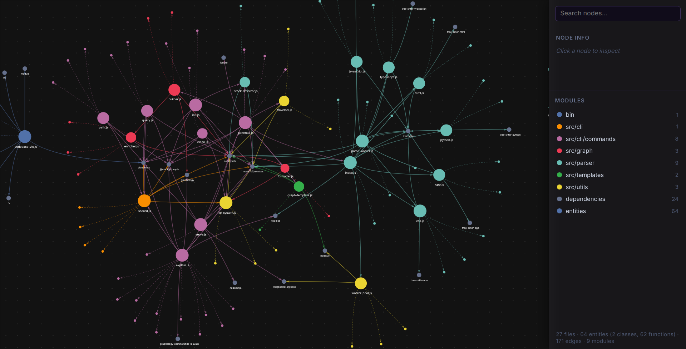

# codebase-vis

[](https://www.npmjs.com/package/codebase-vis)
[](https://nodejs.org)
[](LICENSE)

A local CLI tool that parses codebases, builds dependency graphs from AST analysis, and outputs interactive architecture visualizations.



> See [USAGE.md](USAGE.md) for command examples and screenshots.

## Quick Start

```bash
npm install -g codebase-vis
cd my-project
codebase-vis init     # create .agentignore
codebase-vis generate # parse & build graph
codebase-vis serve    # open visualizer at localhost:3000
```

## Architecture Overview

```
Source files
    │
    ▼
.discoverFiles() ──── .agentignore (5-layer filter)
    │
    ▼
.splitFilesByCache() ── .cache.json (mtime + size fingerprint)
    │
    ├── cached → skip
    └── fresh → WorkerPool (fork() × CPU-1)
                    │
                    ▼
              tree-sitter AST per language
              (JS, TS, Python, C++, HTML, CSS)
                    │
                    ▼
              { dependencies, entities }
                    │
                    ▼
buildGraph() ── graphology (directed multi-graph)
    │
    ▼
enrichNodes() ── Louvain community detection
    │               → undirected subgraph
    │               → graphology-communities-louvain
    │               → directory-based naming (disambiguated)
    │               → 12-color palette assignment
    │
    ▼
exportGraphToJson() ── graph.json
getHtmlTemplate()  ── graph.html (self-contained)
    │
    ▼
codebase-vis explain (optional)
    │   └── clusterGraph() → batches of 8
    │       └── TokenBucket (30 RPM) + mapConcurrent (2 workers)
    │           └── callLLMWithRetry (exponential backoff ×5)
    │               └── semantic-summary.md
```

## How It Works

### AST-Driven Parsing

codebase-vis uses **[tree-sitter](https://tree-sitter.github.io/tree-sitter/)** — incremental, error-tolerant parsers that produce a concrete syntax tree for each language. This is fundamentally different from regex-based dependency extraction: tree-sitter understands grammar, not patterns.

Each language module defines tree-sitter S-expression queries that capture real import/require/include statements:

| Language | Query Targets | Examples Captured |
|----------|--------------|-------------------|
| JavaScript | `import_statement`, `call_expression` (`require` + `import()`) | `import { x } from 'y'`, `const x = require('y')` |
| TypeScript | Same as JS (both `.ts` and `.tsx` grammars) | ES imports, `require()`, dynamic imports |
| Python | `import_statement`, `import_from_statement` (absolute + relative) | `import os`, `from .foo import bar` |
| C++ | `preproc_include` (system + string literals) | `#include <vector>`, `#include "my.h"` |
| HTML | `element` with `src`/`href` attributes, `script_element` | `<link href="...">`, `<script src="...">` |
| CSS | `import_statement`, `url()` call expressions | `@import "file.css"`, `background: url("img.png")` |

Each file is also scanned for **entities** — classes, functions, methods, and docstrings — using dedicated tree-sitter queries per language. For example, Python's method query handles decorators:

```
query `
  (class_definition body: (block (function_definition name: (identifier) @method_name)))
  (class_definition body: (block (decorated_definition definition: (function_definition name: (identifier) @method_name))))
`
```

Methods are excluded from top-level function lists via a `Set` deduplication to avoid double-counting. JSDoc/docstring comments are captured and later fed to the LLM during `explain`.

Parsers are instantiated once per file extension and cached in a `Map` to avoid re-initializing tree-sitter grammars for every file.

### Parallel Worker Pool

Parsing is CPU-bound (tree-sitter compiles native C++ parsers). To maximize throughput, codebase-vis spawns a pool of **child processes via `fork()`**:

```
WorkerPool(size = CPU count - 1)
    │
    ├── worker[0] (fork → parse-worker.js)
    ├── worker[1] (fork → parse-worker.js)
    ├── ...
    └── worker[n] (fork → parse-worker.js)
```

**How it works:**

- The pool maintains a `#free` list of idle workers and a `#queue` of pending file paths.
- `pool.run(file)` returns a Promise. The task is enqueued, then `#drain()` assigns it to the next free worker via `worker.send(file)`.
- Each worker loads its own tree-sitter parsers (grammars are cached per-process), parses the file, and sends the result back via `process.send()`.
- The main process captures the result at the correct array index (`results[i] = result`) to **preserve input order** regardless of completion order.

**Crash recovery:** If a worker exits with non-zero code or throws, the pool registers the failure, rejects the pending promise, spawns a replacement worker, and re-queues any unprocessed tasks. This prevents a single corrupted file from stalling the entire parse.

**Defaults:** `CPU count - 1` workers (e.g., 7 workers on an 8-core machine). Overridable via `--jobs <number>`.

### Incremental Parsing Cache

Re-parsing a large codebase from scratch every time is slow. codebase-vis maintains a `.cache.json` file inside `codebase-out/` that stores the parsed result of every file alongside its **mtime (modification time)** and **file size**.

```
.cache.json
├── version: 1
└── files:
    ├── /abs/path/to/file.js → { mtime: 1700000000, size: 1234, data: { id, dependencies, entities } }
    └── ...
```

**On subsequent `generate` runs:**

1. `splitFilesByCache()` compares each discovered file's current `stat.mtimeMs` and `stat.size` against the cache entry.
2. **Match** → parsed data is restored from cache (zero parsing cost).
3. **Mismatch or missing** → file is queued for fresh parsing.
4. `getStalePaths()` identifies cache entries whose files no longer exist and prunes them.
5. After parsing, `buildUpdatedCache()` writes the new cache with fresh fingerprints.

This makes `codebase-vis generate` near-instant on repeated runs for codebases with few changes — only the modified files are re-parsed.

### Multi-Layer Ignore System (.agentignore)

File discovery applies five layers of ignore patterns merged into a single `ignore` instance (via the [`ignore`](https://www.npmjs.com/package/ignore) npm package, which implements `.gitignore`-style rules):

| Layer | Source | Examples |
|-------|--------|---------|
| **1. Hardcoded** | `HARDCODED_IGNORES` in `generate.js` | `.git`, `node_modules`, `.agentignore`, `.gitignore`, `LICENSE`, `README.md`, `CHANGELOG.md`, `to-be-done-*` |
| **2. Stack-specific** | `STACK_IGNORES` from `detectTechStack()` | Node: `dist`, `build`, `.next`; Python: `venv`, `__pycache__`, `*.pyc`; C++: `cmake-build-*`, `.vscode` |
| **3. Non-code patterns** | `NON_CODE_PATTERNS` constant | `*.txt`, `*.md`, `*.json`, `*.yaml`, `*.png`, `*.jpg`, `*.pdf`, all font files |
| **4. `.agentignore` file** | User-editable file (created by `init`) | Custom patterns specific to the project |
| **5. CLI `--ignore` flag** | Runtime option | `codebase-vis generate --ignore tests,fixtures` |

The `init` command auto-detects your tech stack (via `detectTechStack()` — checks for `package.json`, `pyproject.toml`, `CMakeLists.txt`, etc.) and generates a `.agentignore` with relevant defaults plus a `# --- Add your custom patterns below ---` section for user additions.

During file traversal (`discoverFiles()`), every entry's relative path from the project root is checked with `ig.ignores(relPath)`. Ignored directories are never entered. Files larger than **2 MB** are skipped regardless. Directory recursion runs with a concurrency of 32 to handle deep trees efficiently.

### Graph Construction & Louvain Community Detection

After parsing, `buildGraph()` constructs a **directed multi-graph** using [graphology](https://graphology.github.io/):

- **File nodes** → primary nodes with `{ dependencies, entities }` attributes.
- **Entity sub-nodes** → secondary nodes (classes, functions, methods) connected to their parent file via `contains` edges (dashed lines in the visualizer). Identified by `file.js::ClassName` notation.
- **External packages** → nodes with `{ external: true, npm: boolean }` for imported npm packages not found in the local file tree.

Then `enrichNodes()` runs **Louvain community detection**:

1. **Build an undirected subgraph** of file-only nodes (excluding entities and external packages).
2. **Run `graphology-communities-louvain`** on this subgraph. Louvain is a heuristic algorithm that maximizes modularity — it groups files that are densely connected by dependency edges into communities.
3. **Name each community** by finding the most frequent directory among its member files via `findCommonRoot()`:

   ```js
   function nameCommunities(communityFileMap, commonRoot) {
     // For each community, count files per directory
     // Pick the directory with the most files
     // Disambiguate duplicates with #1, #2 suffixes
   }
   ```

   If two communities share the same dominant directory (e.g., both are `src/utils`), they get disambiguated as `src/utils #1` and `src/utils #2`.
4. **Assign colors** from a 12-color palette:

   ```js
   const PALETTE = ['#4E79A7', '#F28E2B', '#E15759', ...];
   ```

   External packages get `#2d6a4f` (green, community group `dependencies`). Entity nodes get `#6a2d6a` (purple) while inheriting their parent file's community name.
5. **Set visual attributes** per node: `size` proportional to degree (clamped 5–15), random initial `x`/`y` coordinates (ForceAtlas2 in the browser rearranges them), `language` detected from file extension, and `label` defaulting to the file's basename.

The resulting graph is exported as `graph.json` in [graphology JSON format](https://graphology.github.io/serialization.html), with all community and color attributes embedded.

### Interactive Visualization

The generated `graph.html` is a **self-contained single file** — no build step, no server dependency, no CDN references. It embeds:

- **[vis-network](https://visjs.github.io/vis-network/docs/network/)** with **ForceAtlas2**-based layout for physics-driven node positioning.
- **Dark-mode UI** with glassmorphism sidebar and search bar.
- **Community legend** — toggle visibility of entire modules (Louvain clusters, external dependencies, entities) via color-coded checkboxes.
- **Click-to-inspect** — clicking any node shows its module, language, connection count, andclickable neighbor links.
- **Fuzzy search** across all node labels with smooth pan-to-node animation.
- **Dependency/entity toggles** — quick-show/hide for npm packages and inline entities.

The graph loads `graph.json` via `fetch()` at runtime. Because the JSON and HTML are always kept together in `codebase-out/`, the visualizer works by opening the file directly or via `codebase-vis serve`.

### Explain Command: Concurrency & Rate Limiting

The `explain` command sends clusters to the Groq API for LLM-generated architectural summaries. This is the only feature that touches the network, and it's designed to be a good API citizen.

**Rate Limiting — Token Bucket:**

```js
class TokenBucket {
  constructor(rpm) {
    this.#maxTokens = rpm;
    this.#tokens = rpm;
    this.#refillInterval = 60000 / rpm;  // e.g., 2000ms for 30 RPM
  }

  async acquire() {
    while (true) {
      this.#refill();
      if (this.#tokens > 0) {
        this.#tokens--;
        return;
      }
      await new Promise(r => setTimeout(r, this.#refillInterval));
    }
  }
}
```

The token bucket is a **leaky bucket** variant: tokens refill continuously at `60000 / RPM` ms per token. `acquire()` blocks until a token is available. This ensures the request rate never exceeds the configured RPM — even under retries.

**Concurrency — `mapConcurrent`:**

```js
async function mapConcurrent(items, concurrency, fn, onProgress) {
  // Spawn N worker async functions
  // Each pulls from shared index (idx++) for race-free item assignment
  // Results collected in original order via index-based placement
  // onProgress called after each completion
}
```

**Knobs:**

| Flag | Default | Max | Description |
|------|---------|-----|-------------|
| `--rpm` | 30 | — | API requests per minute (shared across all workers) |
| `--concurrency` | 2 | 5 | Parallel LLM requests in flight |

At defaults (2 workers, 30 RPM): each worker averages 15 requests per minute, or one every 4 seconds.

**Retry Logic — Exponential Backoff:**

```js
async function callLLMWithRetry(apiKey, model, payload, bucket) {
  for (let attempt = 0; attempt < 5; attempt++) {
    await bucket.acquire();         // ← token consumed per attempt
    try {
      return await callLLM(apiKey, model, payload);
    } catch (err) {
      if (err.status !== 429 || attempt === 4) throw err;
      const delay = Math.min(1000 * Math.pow(2, attempt), 32000);
      await new Promise(r => setTimeout(r, delay));
    }
  }
}
```

| Attempt | Backoff |
|---------|---------|
| 0 | 1s |
| 1 | 2s |
| 2 | 4s |
| 3 | 8s |
| 4 | 16s (then give up) |

Only **HTTP 429 (Rate Limited)** triggers a retry. Non-429 errors (auth failures, timeouts) throw immediately. Each retry attempt consumes a token from the bucket, preventing retry storms from overwhelming the API.

**Retry State Persistence:**

Failed clusters are saved to `codebase-out/.explain-retry.json`:

```json
[
  {
    "index": 3,
    "batch": ["src/file1.js", "src/file2.js"],
    "payload": { /* extracted AST data */ },
    "error": "Rate limited",
    "totalClusters": 12
  }
]
```

Running `codebase-vis explain --retry` reads this file and re-attempts only the failed clusters. On full success, the file is deleted. On partial success, remaining failures are re-written.

### Why BYOK (Bring Your Own Key)

The `explain` command is the **only feature** that requires an external API. Everything else — parsing, graph building, visualization, querying, path tracing — runs entirely on your machine with zero network calls.

**Why BYOK instead of bundling a key or running a proxy service:**

1. **No usage costs passed to users** — If we bundled a key, we'd have to meter usage, add auth, and pass the cost to users anyway. BYOK means you pay Groq directly for what you use.

2. **Privacy by default** — No data ever reaches our servers. Your codebase, your dependencies, your architecture stay on your machine. The only data that leaves is whatever you choose to send to Groq via your own API key.

3. **Model flexibility** — BYOK lets you use any model Groq supports: `llama-3.1-8b-instant`, `openai/gpt-oss-120b`, `mixtral-8x7b-32768`, etc. You control the model, temperature, and token limits.

4. **No vendor lock-in** — The Groq API is OpenAI-compatible. Swapping providers means changing the endpoint URL and API key format.

Credentials are stored in `~/.codebase-vis/config.json` and can be reset with `--reset` or overridden per-run via the `GROQ_API_KEY` environment variable.

### Dependency Query & Shortest Path

Two terminal commands that operate on the generated graph without needing the browser.

**`query <target>`** — Shows all dependencies (outbound edges) and dependents (inbound edges) for a given file. Uses **fuzzy partial-name matching** with an interactive selector when multiple nodes match. Output is color-coded: cyan `●` for files, yellow `◆` for packages, magenta `◇` for entities.

**`path <source> <target>`** — Finds the shortest dependency chain between any two nodes using **bidirectional BFS** (breadth-first search):

```
Standard BFS:     Search from source → frontier expands one direction
Bidirectional:    Search from source AND target simultaneously
                  Meet in the middle → cuts search space exponentially
```

For a graph with branching factor `b` and depth `d`, unidirectional BFS visits `O(b^d)` nodes while bidirectional BFS visits `O(b^(d/2))`. On a codebase with thousands of files, this is the difference between milliseconds and minutes.

### Entity-Level Granularity

Beyond file-to-file dependency edges, codebase-vis extracts **inline entities** — classes, functions, methods, and docstrings — and promotes them to first-class graph nodes.

```
File: src/handler.js
  ├── ::Handler           (class)
  ├── ::validateToken     (function)
  ├── ::handleRequest     (method)
  └── ::processData       (method)
```

Entity nodes are:

- Connected to their parent file via dashed `contains` edges
- Rendered at size 3 (smaller than file nodes) in purple color
- Filterable via the "Entities" toggle in the visualizer
- Included in LLM payloads during `explain` (docstrings and class/function names give the AI structural context)
- Hidden by default unless you hover near the parent file area

This granularity surfaces architectural detail that pure file-level graphs miss — like whether a single file is responsible for too many distinct responsibilities.

### Zero-Cloud Local-First Design

Every feature except `explain` runs **100% locally**:

- **No accounts** — No signup, no OAuth, no SaaS tier.
- **No telemetry** — No analytics, no crash reporting, no usage tracking.
- **No servers** — The visualizer is a static HTML file. `codebase-vis serve` is an optional convenience that serves it via HTTP.
- **Sandboxed output** — All generated files are constrained to `codebase-out/`. Path traversal attempts are blocked by verifying the resolved output path starts with the sandbox root.
- **Automatic update checking** — Once per hour, checks npm registry for a newer version (cache keyed on current version + date). Prints a yellow notice if one exists. Never blocks or auto-updates.

## Quick Reference

| Command | Flags |
|---------|-------|
| `init` | — |
| `generate [paths...]` | `--ignore`, `--no-clear`, `--verbose`, `--jobs` |
| `serve` | `-p, --port` |
| `query <target>` | — |
| `path <source> <target>` | — |
| `explain` | `--model`, `--concurrency`, `--rpm`, `--retry`, `--reset` |
| `clean` | — |

> See [USAGE.md](USAGE.md) for full command examples, screenshots, and terminal output.

## Output Files

All generated files live under `codebase-out/` in the working directory.

| File | Description |
|------|-------------|
| `graph.json` | Full dependency graph in [graphology](https://graphology.github.io/) JSON format with community, color, language, and semantic_summary attributes |
| `graph.html` | Self-contained interactive visualiser (open in any browser) |
| `semantic-summary.md` | LLM-generated architectural report (created by `explain`) |
| `cache.json` | Incremental parse cache (mtime + size fingerprints) |
| `.explain-retry.json` | Failed clusters for retry (created when some clusters fail) |

## Prerequisites

- **Node.js >= 18**
- **C++ compiler toolchain** — required by tree-sitter to compile native parser modules on first install

  | Platform | Package |
  |----------|---------|
  | Linux | `build-essential` |
  | macOS | Xcode Command Line Tools (`xcode-select --install`) |
  | Windows | MSVC Build Tools or Visual Studio with "Desktop development with C++" |

## Install

```bash
npm install -g codebase-vis
```

Or run without installing:

```bash
npx codebase-vis <command>
```

## Supported Languages

| Language | File Extensions |
|----------|-----------------|
| JavaScript | `.js`, `.jsx` |
| TypeScript | `.ts`, `.tsx` |
| Python | `.py` |
| C / C++ | `.cpp`, `.h`, `.hpp` |
| HTML | `.html` |
| CSS | `.css` |

## Troubleshooting

**tree-sitter build fails on install**
Make sure a C++ compiler is installed (see [Prerequisites](#prerequisites)). On Windows, ensure MSVC is available — install "Desktop development with C++" via the Visual Studio Installer.

**Port already in use**
Pass a different port: `codebase-vis serve --port 4000`.

**"graph.json not found"**
Run `codebase-vis generate` first to create the graph data.

**No files found during generate**
Check your `.agentignore` file — you may be excluding the target directory. Use `--verbose` to see which files are being processed.
