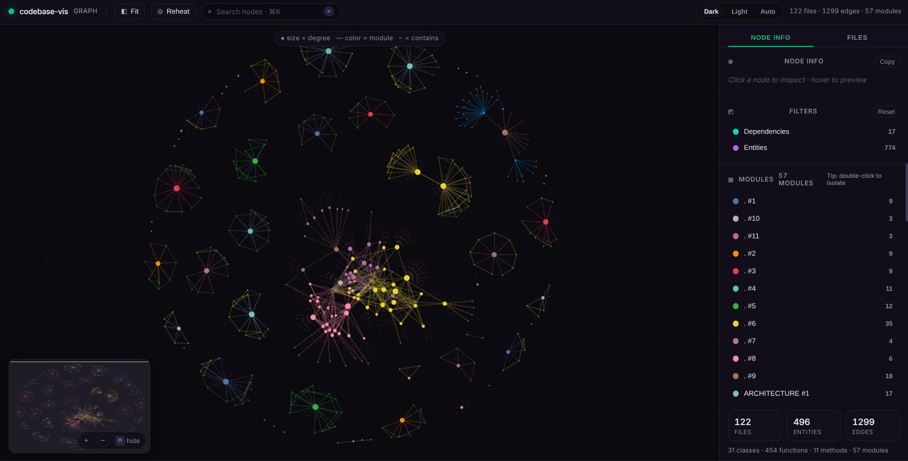

# codebase-vis

[](https://www.npmjs.com/package/codebase-vis)
[](https://nodejs.org)
[](LICENSE)

A CLI tool that parses your codebase using AST analysis, builds a dependency graph, and outputs an interactive visualization. Zero cloud, zero accounts, runs entirely on your machine.



## Quick Start

```bash
npm install -g codebase-vis
cd your-project
codebase-vis init        # creates .agentignore
codebase-vis generate    # parses code, builds graph
codebase-vis serve       # opens http://localhost:3000
```

That's it. You get a `codebase-out/` folder with `graph.json` (machine-readable graph) and `graph.html` (interactive visualizer you can open in any browser).

## Commands

### `init`

Creates an `.agentignore` file with sensible defaults for your tech stack. Edit it before running `generate` if you want to exclude directories.

```bash
codebase-vis init
```

### `generate [paths...]`

The main command. Parses your codebase, builds the dependency graph, and writes the output files.

```bash
codebase-vis generate                  # whole project
codebase-vis generate src/api src/db   # specific directories only
codebase-vis generate --verbose        # show per-file parse details
codebase-vis generate --jobs 4         # limit worker count
codebase-vis generate --ignore tests,fixtures  # extra exclusions
```

On repeated runs, only changed files are re-parsed. If nothing changed, the command exits instantly.

### `serve`

Starts a local HTTP server and opens the visualizer in your browser.

```bash
codebase-vis serve              # default port 3000
codebase-vis serve --port 4000  # custom port
```

### `query <target>`

Inspects a single file's dependencies and dependents from the terminal. Useful for quick checks without opening the browser.

```bash
codebase-vis query src/graph/builder.js
```

### `path <source> <target>`

Finds the shortest dependency chain between two files. Uses bidirectional BFS — works fast even on large codebases.

```bash
codebase-vis path src/db/schema.ts src/components/Checkout.tsx
```

### `detect`

Finds circular dependencies in your project. Writes `cycles.json` which the visualizer can highlight.

```bash
codebase-vis detect
```

### `explain`

Sends your codebase structure to an LLM (Groq API) for architectural summaries. Requires a Groq API key.

```bash
codebase-vis explain                    # uses default model
codebase-vis explain --model llama-3.1-8b-instant
codebase-vis explain --retry            # retry failed clusters
```

This is the only command that makes network requests. Everything else runs 100% locally.

### `clean`

Deletes the `codebase-out/` directory.

```bash
codebase-vis clean
```

## Configuration

### `.agentignore`

Created by `init`. Uses `.gitignore`-style patterns. The tool always ignores `node_modules/`, `.git/`, `dist/`, `build/`, `coverage/`, and `codebase-out/` regardless of what's in this file.

### Environment Variables

| Variable | Purpose |
|---|---|
| `GROQ_API_KEY` | API key for the `explain` command |
| `NODE_OPTIONS="--max-old-space-size=4096"` | For very large codebases (>50k files) |

## Output Files

Everything goes into `codebase-out/`:

| File | What it is |
|---|---|
| `graph.json` | Full dependency graph in graphology JSON format |
| `graph.html` | Self-contained interactive visualizer (open in any browser) |
| `cycles.json` | Circular dependency data (created by `detect`) |
| `semantic-summary.md` | LLM-generated architecture report (created by `explain`) |
| `.cache.json` | Incremental parse cache (enables fast re-runs) |

## Supported Languages

| Language | Extensions |
|---|---|
| JavaScript | `.js`, `.jsx` |
| TypeScript | `.ts`, `.tsx` |
| Python | `.py` |
| C/C++ | `.cpp`, `.h`, `.hpp` |
| Go | `.go` |
| Java | `.java` |
| Rust | `.rs` |
| HTML | `.html` |
| CSS | `.css` |

## Prerequisites

- **Node.js >= 18**
- **C++ compiler** — tree-sitter compiles native parsers on first install

| Platform | What to install |
|---|---|
| Linux | `build-essential` (Ubuntu/Debian) or `gcc` + `g++` |
| macOS | Xcode Command Line Tools: `xcode-select --install` |
| Windows | MSVC Build Tools or Visual Studio with "Desktop development with C++" |

## How It Works

codebase-vis uses [tree-sitter](https://tree-sitter.github.io/tree-sitter/) to parse your code into ASTs, extracts import/require statements and entity definitions (classes, functions, methods), then builds a directed multi-graph with [graphology](https://graphology.github.io/). Community detection via the Louvain algorithm groups related files into modules. The result is rendered as an interactive D3 force-directed graph in a self-contained HTML file.

For the full pipeline walkthrough, see [HOW_IT_WORKS.md](HOW_IT_WORKS.md).

## Troubleshooting

**tree-sitter build fails on install**
You need a C++ compiler. See [Prerequisites](#prerequisites).

**Port already in use**
`codebase-vis serve --port 4000` — pick a different port.

**"graph.json not found"**
Run `codebase-vis generate` first.

**No files found during generate**
Check your `.agentignore` — you might be excluding everything. Use `--verbose` to see what's being processed.

**Out of memory on huge codebases**
Set `NODE_OPTIONS="--max-old-space-size=8192"` before running generate.

## License

ISC
