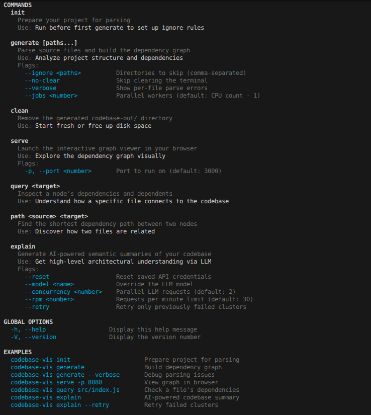
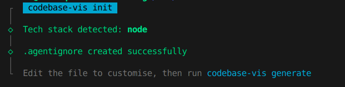
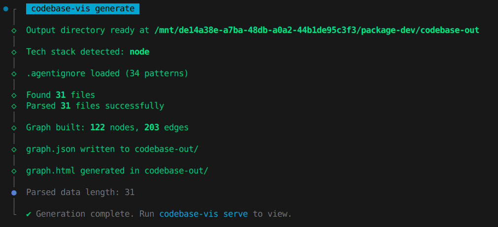
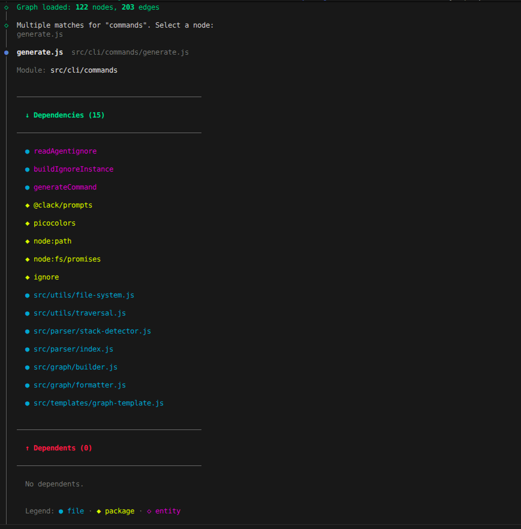
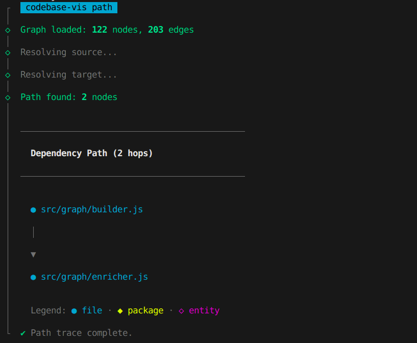
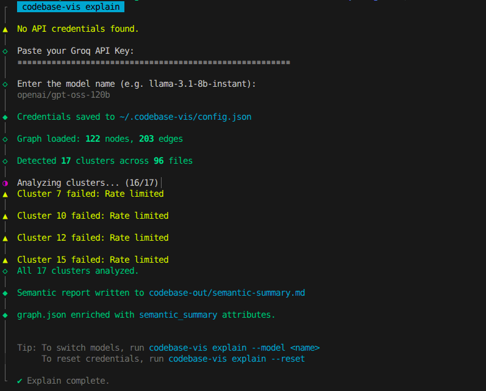
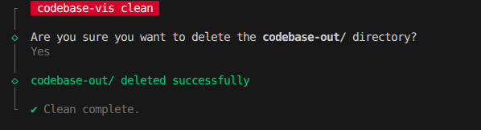
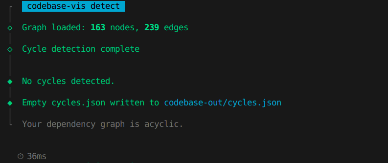
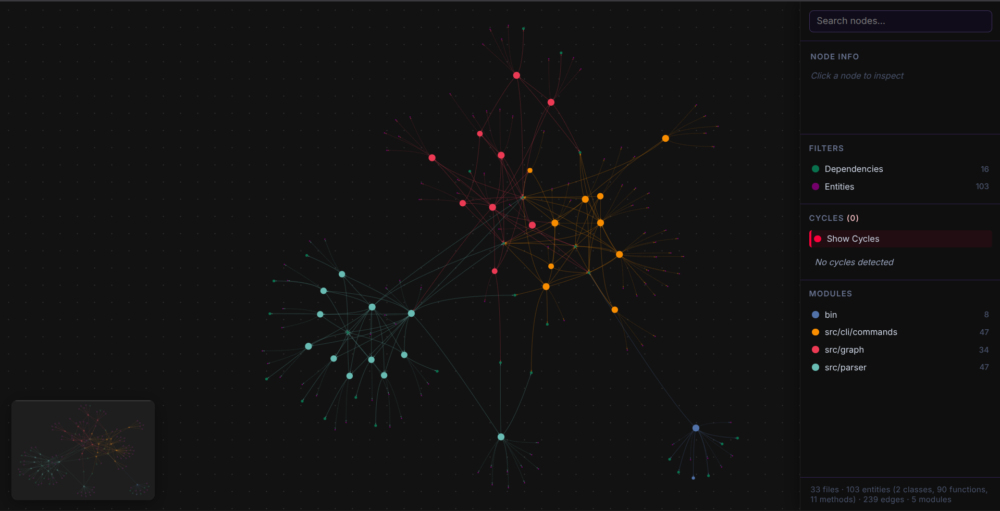

# Usage

A visual guide to `codebase-vis` commands and their output, using the `codebase-vis` codebase itself as the example project.

## Commands

list of commands and flags


### `init`

```bash
codebase-vis init
```



### `generate`

```bash
codebase-vis generate
```



### `serve`

```bash
codebase-vis serve
```

Open `http://localhost:3000` in your browser to explore the interactive graph.


### `query`

```bash
codebase-vis query src/cli/commands/generate.js
```



### `path`

```bash
codebase-vis path src/graph/builder.js src/graph/enricher.js
```



### `explain`

```bash
codebase-vis explain
```



### `clean`

```bash
codebase-vis clean
```



### `detect`

```bash
codebase-vis detect
```

Find circular dependencies in your dependency graph. Prints detected cycles to the terminal and writes `cycles.json` for visualization.



### `detect-cycle`

After running `detect`, open `graph.html` and click the cycle toggle to highlight cycles in red. Click individual cycles to zoom in.



### `graph.json`

The full dependency graph in graphology JSON format. Contains all nodes, edges, and attributes.

```json
{
  "nodes": [
    {
      "key": "src/bin/codebase-vis.js",
      "attributes": {
        "label": "codebase-vis.js",
        "language": "JavaScript",
        "community": "bin",
        "dependencies": ["commander", "src/cli/commands/index.js", ...]
      }
    }
  ],
  "edges": [
    { "source": "src/bin/codebase-vis.js", "target": "commander" },
    { "source": "src/bin/codebase-vis.js", "target": "src/cli/commands/index.js" }
  ]
}
```
